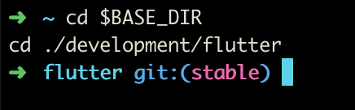
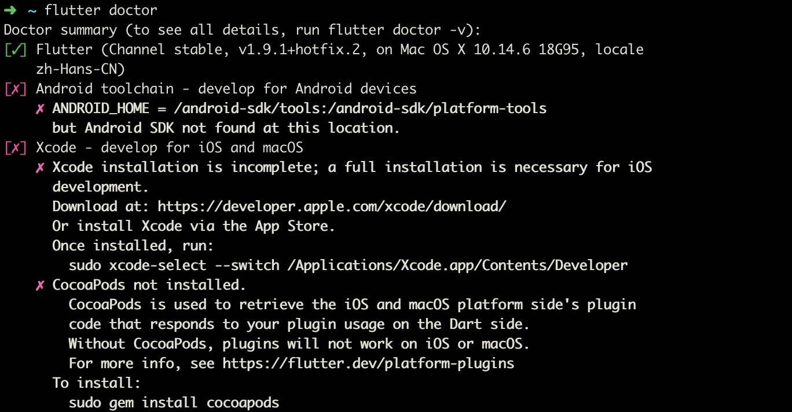
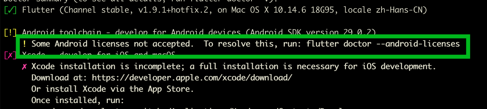
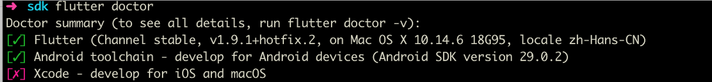
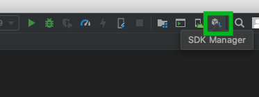
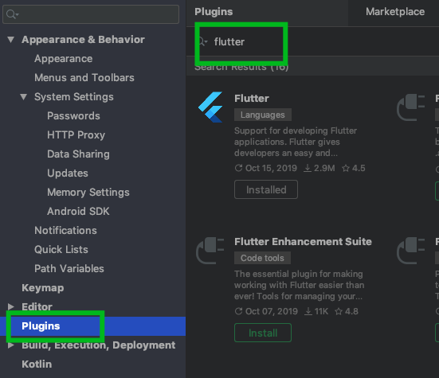
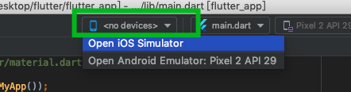
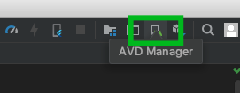
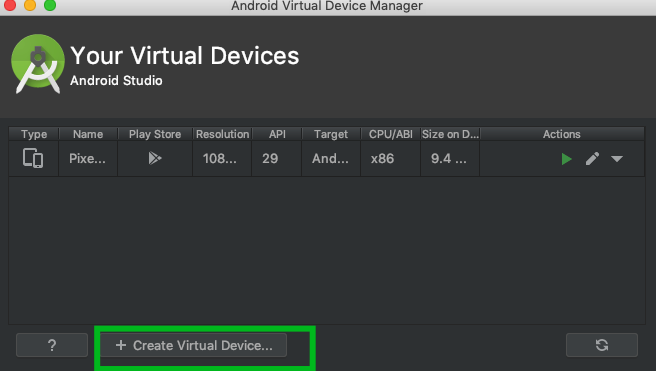
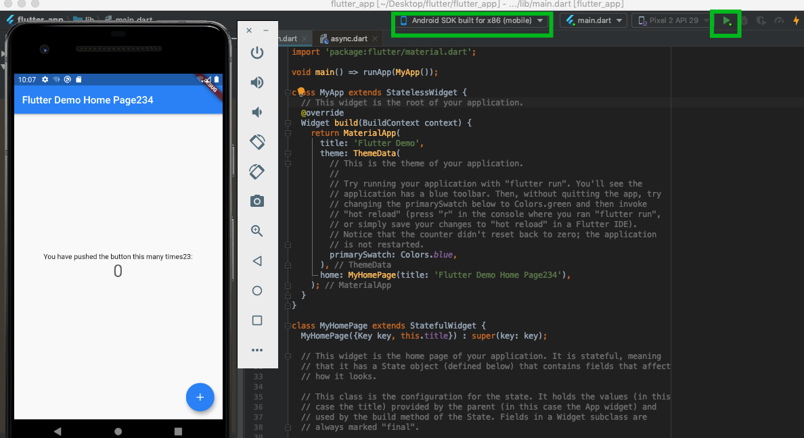

# flutter的mac安装教程

官网 https://flutterchina.club/setup-macos/

> 虽然官网上已经有很详细的教程了，但是作为一名没有开发过客户端，刚买mac不到一年的人来说还是有很多不是很明白的地方，本次教程就是准对完全没有经验的小白的安装教程

## 下载 Flutter SDK

地址：https://flutter.dev/docs/development/tools/sdk/releases?tab=macos#macos

选择 Stable channel (macOS) 稳定渠道的最新版本


## 解压 Flutter SDK 

将下载好的 SDK 解压到 development 文件夹下

```bash
cd ~/development
unzip ~/Downloads/flutter_macos_v0.5.1-beta.zip
# flutter_macos_v0.5.1-beta.zip 是你的下载包，将你下载的名称替换掉
```
## 添加 Flutter SDK 到 path

#### 配置path，配置成功后你可以直接在终端使用 flutter 命令了。

```bash
export PATH=$BASE_DIR/development/flutter/bin:$PATH
# $BASE_DIR 是你的 home 目录 /Users/yourName/
```
#### 这里的目录一定要是你的解压的 Flutter SDK 的位置，你可以进入文件夹试一下

```bash
cd $BASE_DIR
cd ./development/flutter
```
#### 如果能找到就没有问题了



#### 你还可以使用 pwd 查看一下当前的目录

```bash
pwd
```

记住这个目录后面会用到

#### 环境变量设置好之后，执行 source 命令，使 path 生效

```bash
source ~/.bash_profile
```
#### 永久保存命令 

现在可能只是临时生效，下次关闭了窗口之后 flutter 命令就又会失效，为了永久保存，我们需要将 source 添加到 .zshrc 中

在 vim ~/.zshrc 文件最后，增加一行：

```bash
source ~/.bash_profile
```

这样我们的 flutter sdk 的 path 已经彻底配置好了，不熟悉这套设置的还是挺麻烦的

#### 执行检查

在终端运行检查命令，你会发现你除了 Flutter SDK 以外都是 [X]，说明你电脑还没有安装这些功能



#### 安装安卓 sdk

一般安卓 sdk 在 $HOME/Library/Android/sdk 这个目录下，你可以 cd 进去看看有没有这个目录

```bash
cd $HOME/Library/Android/sdk
```

如果存在的话你就可以直接运行 flutter 命令，将安卓sdk path 添加到 flutter

```bash
flutter config --android-sdk $HOME/Library/Android/sdk
```

配置 android-sdk 环境变量

```js
export ANDROID_SDK=$BASE_DIR/android-sdk
export ANDROID_PATH=$ANDROID_SDK/tools:$ANDROID_SDK/platform-tools
export PATH=$BASE_DIR/development/flutter/bin:$PATH
export ANDROID_HOME=${ANDROID_PATH}
export PATH=${PATH}:${ANDROID_HOME}/tools
export PATH=${PATH}:${ANDROID_HOME}/platform-tools
export PUB_HOSTED_URL=https://pub.flutter-io.cn
export FLUTTER_STORAGE_BASE_URL=https://storage.flutter-io.cn
```

##### Mac 每次都要执行 source ~/.bash_profile 配置的环境变量才生效
*.zshrc 这个文件主要保存个人的一些个性化设置，如命令别名、路径等。*

接下来运行一下 flutter doctor 再试一下



会发现有黄色警告，没哟安装安卓证书。

```bash
flutter doctor --android-licenses
```


这时候已经没有问题了，安卓 sdk 已经安装完毕

## 安装 andriod studio

接下来我们需要下载一个编译器，我选择的是 andriod studio，官网上有教程 https://flutterchina.club/setup-macos/#%E5%AE%89%E8%A3%85android-studio

#### 安卓 flutter dart 插件

打开 andriod studio 编译器，找到右上角的 【SDK manager】图标，点击它



找到 plugins，搜索 flutter/dart 并安装即可



#### 下载模拟器

在 devices 按钮下选择你要使用的模拟器



如果没有的话需要下载模拟器，在右上角选择 AVD manager



点击创建虚拟设备



接下来按照步骤下载就可以了

## 运行

选择模拟器。点击 run 按钮

