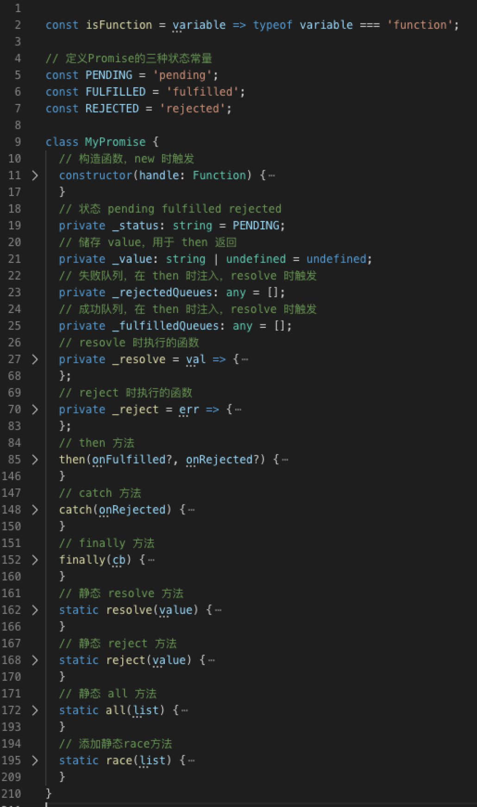

> 阅读源码的好处，不用说都知道，首先进大厂必备，还可以提升自己的能力，学习前人的经验。源码往往是前人留下的最佳实践，我们跟着前人的脚步去学习会让我们事半功倍。

- call、aplly、bind 实现
- new 实现
- class 实现继承
- async/await 实现
- reduce 实现
- 实现一个双向数据绑定
- instanceof 实现
- Array.isArray 实现
- Object.create 的基本实现原理
- getOwnPropertyNames 实现
- promise 实现
- 手写一个防抖/节流函数
- 柯里化函数的实现
- 手写一个深拷贝

## call、aplly、bind 实现

> `call、aplly、bind` 本质都是改变 `this` 的指向，不同点 `call、aplly` 是直接调用函数，`bind` 是返回一个新的函数。`call` 跟 `aplly` 就只有参数上不同。

### bind 实现

- 箭头函数的 `this` 永远指向它所在的作用域
- 函数作为构造函数用 `new` 关键字调用时，不应该改变其 `this` 指向，因为 `new绑定` 的优先级高于 `显示绑定` 和 `硬绑定`

```js
Function.prototype.mybind = function(thisArg) {
    if (typeof this !== 'function') {
      throw TypeError("Bind must be called on a function");
    }
    // 拿到参数，为了传给调用者
    const args = Array.prototype.slice.call(arguments, 1),
      // 保存 this
      self = this,
      // 构建一个干净的函数，用于保存原函数的原型
      nop = function() {},
      // 绑定的函数
      bound = function() {
        // this instanceof nop, 判断是否使用 new 来调用 bound
        // 如果是 new 来调用的话，this的指向就是其实例，
        // 如果不是 new 调用的话，就改变 this 指向到指定的对象 o
        return self.apply(
          this instanceof nop ? this : thisArg,
          args.concat(Array.prototype.slice.call(arguments))
        );
      };

    // 箭头函数没有 prototype，箭头函数this永远指向它所在的作用域
    if (this.prototype) {
      nop.prototype = this.prototype;
    }
    // 修改绑定函数的原型指向
    bound.prototype = new nop();

    return bound;
  }
}
```

3. `测试 mybind`

```js
const bar = function() {
  console.log(this.name, arguments);
};

bar.prototype.name = 'bar';

const foo = {
  name: 'foo'
};

const bound = bar.mybind(foo, 22, 33, 44);
new bound(); // bar, [22, 33, 44]
bound(); // foo, [22, 33, 44]
```

### call 实现

> `bind` 是封装了 `call` 的方法改变了 `this` 的指向并返回一个新的函数，那么 `call` 是如何做到改变 `this` 的指向呢？原理很简单，在方法调用模式下，`this` 总是指向调用它所在方法的对象，`this` 的指向与所在方法的调用位置有关，而与方法的声明位置无关（箭头函数特殊）。先写一个小 `demo` 来理解一下下。

```js
const foo = { name: 'foo' };

foo.fn = function() {
  // 这里的 this 指向了 foo
  // 因为 foo 调用了 fn，
  // fn 的 this 就指向了调用它所在方法的对象 foo 上
  console.log(this.name); // foo
};
```

利用 `this` 的机制来实现 `call`

```js
Function.prototype.mycall = function(thisArg) {
  // this指向调用call的对象
  if (typeof this !== 'function') {
    // 调用call的若不是函数则报错
    throw new TypeError('Error');
  }

  const args = [...arguments].slice(1);
  thisArg = thisArg || window;
  // 将调用call函数的对象添加到thisArg的属性中
  thisArg.fn = this;
  // 执行该属性
  const result = thisArg.fn(...arg);
  // 删除该属性
  delete thisArg.fn;
  // 返回函数执行结果
  return result;
};
```

### aplly 实现

```js
Function.prototype.myapply = function(thisArg) {
  if (typeof this !== 'function') {
    throw this + ' is not a function';
  }

  const args = arguments[1];

  thisArg.fn = this;

  const result = thisArg.fn(...arg);

  delete thisArg.fn;

  return result;
};
```

`测试 mycall myaplly`

```js
const bar = function() {
  console.log(this.name, arguments);
};

bar.prototype.name = 'bar';

const foo = {
  name: 'foo'
};

bar.mycall(foo, 1, 2, 3); // foo [1, 2, 3]
bar.myaplly(foo, [1, 2, 3]); // foo [1, 2, 3]
```

## reduce 实现原理

> arr.reduce(callback(accumulator, currentValue[, index[, array]])[, initialValue])

```js
Array.prototype.myreduce = function reduce(callbackfn) {
  // 拿到数组
  const O = this,
    len = O.length;
  // 下标值
  let k = 0,
    // 累加器
    accumulator = undefined,
    // k下标对应的值是否存在
    kPresent = false,
    // 初始值
    initialValue = arguments.length > 1 ? arguments[1] : undefined;

  if (typeof callbackfn !== 'function') {
    throw new TypeError(callbackfn + ' is not a function');
  }

  // 数组为空，并且有初始值，报错
  if (len === 0 && arguments.length < 2) {
    throw new TypeError('Reduce of empty array with no initial value');
  }

  // 如果初始值存在
  if (arguments.length > 1) {
    // 设置累加器为初始值
    accumulator = initialValue;
    // 初始值不存在
  } else {
    accumulator = O[k];
    ++k;
  }

  while (k < len) {
    // 判断是否为 empty [,,,]
    kPresent = O.hasOwnProperty(k);

    if (kPresent) {
      const kValue = O[k];
      // 调用 callbackfn
      accumulator = callbackfn.apply(undefined, [accumulator, kValue, k, O]);
    }
    ++k;
  }

  return accumulator;
};
```

`测试`

```js
const rReduce = ['1', null, undefined, , 3, 4].reduce((a, b) => a + b, 3);
const mReduce = ['1', null, undefined, , 3, 4].myreduce((a, b) => a + b, 3);

console.log(rReduce, mReduce);
// 31nullundefined34 31nullundefined34
```

## new 实现

> 我们需要知道当 `new` 的时候做了什么事情

1. 创建一个新对象；
2. 将构造函数的作用域赋给新对象（因此 this 就指向了这个新对象）
3. 执行构造函数中的代码（为这个新对象添加属性）
4. 返回新对象。

因为 new 没办法重写，我们使用 `myNew` 函数来模拟 `new`

```js
function myNew() {
  // 创建一个实例对象
  var obj = new Object();
  // 取得外部传入的构造器
  var Constructor = Array.prototype.shift.call(arguments);
  // 实现继承，实例可以访问构造器的属性
  obj.__proto__ = Constructor.prototype;
  // 调用构造器，并改变其 this 指向到实例
  var ret = Constructor.apply(obj, arguments);
  // 如果构造函数返回值是对象则返回这个对象，如果不是对象则返回新的实例对象
  return typeof ret === 'object' ? ret : obj;
}
```

`测试 myNew`

```js
// ========= 无返回值 =============
const testNewFun = function(name) {
  this.name = name;
};

const newObj = myNew(testNewFun, 'foo');

console.log(newObj); // { name: "foo" }
console.log(newObj instanceof testNewFun); // true
// ========= 有返回值 =============
const testNewFun = function(name) {
  this.name = name;
  return {};
};

const newObj = myNew(testNewFun, 'foo');

console.log(newObj); // {}
console.log(newObj instanceof testNewFun); // false
```

## class 实现继承

> 主要使用 `es5` 跟 `es6` 对比看下 `class` 继承的原理

实现继承 `A extends B`

使用 `es6` 语法

```js
class B {
  constructor(opt) {
    this.BName = opt.name;
  }
}
class A extends B {
  constructor() {
    // 向父类传参
    super({ name: 'B' });
    // this 必须在 super() 下面使用
    console.log(this);
  }
}
```

使用 `es5` 语法

使用寄生组合继承的方式

1. 原型链继承，使子类可以调用父类原型上的方法和属性
2. 借用构造函数继承，可以实现向父类传参
3. 寄生继承，创造干净的没有构造方法的函数，用来寄生父类的 prototype

```js
// 实现继承，通过继承父类 prototype
function __extends(child, parent) {
  // 修改对象原型
  Object.setPrototypeOf(child, parent);
  // 寄生继承，创建一个干净的构造函数，用于继承父类的 prototype
  // 这样做的好处是，修改子类的 prototype 不会影响父类的 prototype
  function __() {
    // 修正 constructor 指向子类
    this.constructor = child;
  }
  // 原型继承，继承父类原型属性，但是无法向父类构造函数传参
  child.prototype =
    parent === null
      ? Object.create(parent)
      : ((__.prototype = parent.prototype), new __());
}

var B = (function() {
  function B(opt) {
    this.name = opt.name;
  }
  return B;
})();

var A = (function(_super) {
  __extends(A, _super);
  function A() {
    // 借用继承，可以实现向父类传参, 使用 super 可以向父类传参
    return (_super !== null && _super.apply(this, { name: 'B' })) || this;
  }
  return A;
})(B);
```

`测试 class`

```js
const a = new A();

console.log(a.BName, a.constructor); // B ,ƒ A() {}
```

## async/await 实现

> 原理就是利用 `generator`（生成器）分割代码片段。然后我们使用一个函数让其自迭代，每一个`yield` 用 `promise` 包裹起来。执行下一步的时机由 `promise` 来控制

`async/await` 是关键字，不能重写它的方法，我们使用函数来模拟

异步迭代，模拟异步函数

```js
function _asyncToGenerator(fn) {
  return function() {
    var self = this,
      args = arguments;
    // 将返回值promise化
    return new Promise(function(resolve, reject) {
      // 获取迭代器实例
      var gen = fn.apply(self, args);
      // 执行下一步
      function _next(value) {
        asyncGeneratorStep(gen, resolve, reject, _next, _throw, 'next', value);
      }
      // 抛出异常
      function _throw(err) {
        asyncGeneratorStep(gen, resolve, reject, _next, _throw, 'throw', err);
      }
      // 第一次触发
      _next(undefined);
    });
  };
}
```

执行迭代步骤，处理下次迭代结果

```js
function asyncGeneratorStep(gen, resolve, reject, _next, _throw, key, arg) {
  try {
    var info = gen[key](arg);
    var value = info.value;
  } catch (error) {
    reject(error);
    return;
  }
  if (info.done) {
    // 迭代器完成
    resolve(value);
  } else {
    // -- 这行代码就是精髓 --
    // 将所有值promise化
    // 比如 yield 1
    // const a = Promise.resolve(1) a 是一个 promise
    // const b = Promise.resolve(a) b 是一个 promise
    // 可以做到统一 promise 输出
    // 当 promise 执行完之后再执行下一步
    // 递归调用 next 函数，直到 done == true
    Promise.resolve(value).then(_next, _throw);
  }
}
```

`测试 _asyncToGenerator`

```js
const asyncFunc = _asyncToGenerator(function*() {
  const e = yield new Promise(resolve => {
    setTimeout(() => {
      resolve('e');
    }, 1000);
  });
  const a = yield Promise.resolve('a');
  const d = yield 'd';
  const b = yield Promise.resolve('b');
  const c = yield Promise.resolve('c');
  return [a, b, c, d, e];
});

asyncFunc().then(res => {
  console.log(res); // ['a', 'b', 'c', 'd', 'e']
});
```

## 实现一个双向绑定

`defineProperty` 版本

```js
// 数据
const data = {
  text: 'default'
};
const input = document.getElementById('input');
const span = document.getElementById('span');
// 数据劫持
Object.defineProperty(data, 'text', {
  // 数据变化 --> 修改视图
  set(newVal) {
    input.value = newVal;
    span.innerHTML = newVal;
  }
});
// 视图更改 --> 数据变化
input.addEventListener('keyup', function(e) {
  data.text = e.target.value;
});
```

`proxy` 版本

```js
// 数据
const data = {
  text: 'default'
};
const input = document.getElementById('input');
const span = document.getElementById('span');
// 数据劫持
const handler = {
  set(target, key, value) {
    target[key] = value;
    // 数据变化 --> 修改视图
    input.value = value;
    span.innerHTML = value;
    return value;
  }
};
const proxy = new Proxy(data);

// 视图更改 --> 数据变化
input.addEventListener('keyup', function(e) {
  proxy.text = e.target.value;
});
```

## Object.create 的基本实现原理

```js
function create(obj) {
  function F() {}
  F.prototype = obj;
  return new F();
}
```

## instanceof 实现

> 原理： `L` 的 `__proto__` 是不是等于 `R.prototype`，不等于再找 `L.__proto__.__proto__` 直到 `__proto__` 为 `null`

```js
// L 表示左表达式，R 表示右表达式
function instance_of(L, R) {
  var O = R.prototype;
  L = L.__proto__;
  while (true) {
    if (L === null) return false;
    // 这里重点：当 O 严格等于 L 时，返回 true
    if (O === L) return true;
    L = L.__proto__;
  }
}
```

## Array.isArray 实现

```js
Array.myIsArray = function(o) {
  return Object.prototype.toString.call(Object(o)) === '[object Array]';
};

console.log(Array.myIsArray([])); // true
```

## getOwnPropertyNames 实现

```js
if (typeof Object.getOwnPropertyNames !== 'function') {
  Object.getOwnPropertyNames = function(o) {
    if (o !== Object(o)) {
      throw TypeError('Object.getOwnPropertyNames called on non-object');
    }
    var props = [],
      p;
    for (p in o) {
      if (Object.prototype.hasOwnProperty.call(o, p)) {
        props.push(p);
      }
    }
    return props;
  };
}
```

## Promise 实现

> 实现原理：其实就是一个发布订阅者模式

1. 构造函数接收一个 `executor` 函数，并会在 `new Promise()` 时立即执行该函数
2. `then` 时收集依赖，将回调函数收集到 `成功/失败队列`
3. `executor` 函数中调用 `resolve/reject` 函数
4. `resolve/reject` 函数被调用时会通知触发队列中的回调

先看一下整体代码，有一个大致的概念



完整代码

```js
const isFunction = variable => typeof variable === 'function';

// 定义Promise的三种状态常量
const PENDING = 'pending';
const FULFILLED = 'fulfilled';
const REJECTED = 'rejected';

class MyPromise {
  // 构造函数，new 时触发
  constructor(handle: Function) {
    try {
      handle(this._resolve, this._reject);
    } catch (err) {
      this._reject(err);
    }
  }
  // 状态 pending fulfilled rejected
  private _status: string = PENDING;
  // 储存 value，用于 then 返回
  private _value: string | undefined = undefined;
  // 失败队列，在 then 时注入，resolve 时触发
  private _rejectedQueues: any = [];
  // 成功队列，在 then 时注入，resolve 时触发
  private _fulfilledQueues: any = [];
  // resovle 时执行的函数
  private _resolve = val => {
    const run = () => {
      if (this._status !== PENDING) return;
      this._status = FULFILLED;
      // 依次执行成功队列中的函数，并清空队列
      const runFulfilled = value => {
        let cb;
        while ((cb = this._fulfilledQueues.shift())) {
          cb(value);
        }
      };
      // 依次执行失败队列中的函数，并清空队列
      const runRejected = error => {
        let cb;
        while ((cb = this._rejectedQueues.shift())) {
          cb(error);
        }
      };
      /*
       * 如果resolve的参数为Promise对象，
       * 则必须等待该Promise对象状态改变后当前Promsie的状态才会改变
       * 且状态取决于参数Promsie对象的状态
       */
      if (val instanceof MyPromise) {
        val.then(
          value => {
            this._value = value;
            runFulfilled(value);
          },
          err => {
            this._value = err;
            runRejected(err);
          }
        );
      } else {
        this._value = val;
        runFulfilled(val);
      }
    };
    // 异步调用
    setTimeout(run);
  };
  // reject 时执行的函数
  private _reject = err => {
    if (this._status !== PENDING) return;
    // 依次执行失败队列中的函数，并清空队列
    const run = () => {
      this._status = REJECTED;
      this._value = err;
      let cb;
      while ((cb = this._rejectedQueues.shift())) {
        cb(err);
      }
    };
    // 为了支持同步的Promise，这里采用异步调用
    setTimeout(run);
  };
  // then 方法
  then(onFulfilled?, onRejected?) {
    const { _value, _status } = this;
    // 返回一个新的Promise对象
    return new MyPromise((onFulfilledNext, onRejectedNext) => {
      // 封装一个成功时执行的函数
      const fulfilled = value => {
        try {
          if (!isFunction(onFulfilled)) {
            onFulfilledNext(value);
          } else {
            const res = onFulfilled(value);
            if (res instanceof MyPromise) {
              // 如果当前回调函数返回MyPromise对象，必须等待其状态改变后在执行下一个回调
              res.then(onFulfilledNext, onRejectedNext);
            } else {
              //否则会将返回结果直接作为参数，传入下一个then的回调函数，并立即执行下一个then的回调函数
              onFulfilledNext(res);
            }
          }
        } catch (err) {
          // 如果函数执行出错，新的Promise对象的状态为失败
          onRejectedNext(err);
        }
      };

      // 封装一个失败时执行的函数
      const rejected = error => {
        try {
          if (!isFunction(onRejected)) {
            onRejectedNext(error);
          } else {
            const res = onRejected(error);
            if (res instanceof MyPromise) {
              // 如果当前回调函数返回MyPromise对象，必须等待其状态改变后在执行下一个回调
              res.then(onFulfilledNext, onRejectedNext);
            } else {
              //否则会将返回结果直接作为参数，传入下一个then的回调函数，并立即执行下一个then的回调函数
              onFulfilledNext(res);
            }
          }
        } catch (err) {
          // 如果函数执行出错，新的Promise对象的状态为失败
          onRejectedNext(err);
        }
      };

      switch (_status) {
        // 当状态为pending时，将then方法回调函数加入执行队列等待执行
        case PENDING:
          this._fulfilledQueues.push(fulfilled);
          this._rejectedQueues.push(rejected);
          break;
        // 当状态已经改变时，立即执行对应的回调函数
        case FULFILLED:
          fulfilled(_value);
          break;
        case REJECTED:
          rejected(_value);
          break;
      }
    });
  }
  // catch 方法
  catch(onRejected) {
    return this.then(undefined, onRejected);
  }
  // finally 方法
  finally(cb) {
    return this.then(
      value => MyPromise.resolve(cb()).then(() => value),
      reason =>
        MyPromise.resolve(cb()).then(() => {
          throw reason;
        })
    );
  }
  // 静态 resolve 方法
  static resolve(value) {
    // 如果参数是MyPromise实例，直接返回这个实例
    if (value instanceof MyPromise) return value;
    return new MyPromise(resolve => resolve(value));
  }
  // 静态 reject 方法
  static reject(value) {
    return new MyPromise((resolve, reject) => reject(value));
  }
  // 静态 all 方法
  static all(list) {
    return new MyPromise((resolve, reject) => {
      // 返回值的集合
      let values = [];
      let count = 0;
      for (let [i, p] of list.entries()) {
        // 数组参数如果不是MyPromise实例，先调用MyPromise.resolve
        this.resolve(p).then(
          res => {
            values[i] = res;
            count++;
            // 所有状态都变成fulfilled时返回的MyPromise状态就变成fulfilled
            if (count === list.length) resolve(values);
          },
          err => {
            // 有一个被rejected时返回的MyPromise状态就变成rejected
            reject(err);
          }
        );
      }
    });
  }
  // 添加静态race方法
  static race(list) {
    return new MyPromise((resolve, reject) => {
      for (let p of list) {
        // 只要有一个实例率先改变状态，新的MyPromise的状态就跟着改变
        this.resolve(p).then(
          res => {
            resolve(res);
          },
          err => {
            reject(err);
          }
        );
      }
    });
  }
}
```

## 防抖/截流

> `防抖函数` onscroll 结束时触发一次，延迟执行

```js
function debounce(func, wait) {
  let timeout;
  return function() {
    let context = this;
    let args = arguments;
    if (timeout) clearTimeout(timeout);
    timeout = setTimeout(() => {
      func.apply(context, args);
    }, wait);
  };
}
// 使用
window.onscroll = debounce(function() {
  console.log('debounce');
}, 1000);
```

> `节流函数` onscroll 时，每隔一段时间触发一次，像水滴一样

```js
function throttle(fn, delay) {
  var prevTime = Date.now();
  return function() {
    var curTime = Date.now();
    if (curTime - prevTime > delay) {
      fn.apply(this, arguments);
      prevTime = curTime;
    }
  };
}
// 使用
var throtteScroll = throttle(function() {
  console.log('throtte');
}, 1000);
window.onscroll = throtteScroll;
```

## 函数柯里化实现

> 其实我们无时无刻不在使用柯里化函数，只是没有将它总结出来而已。它的本质就是将一个参数很多的函数分解成单一参数的多个函数。

实际应用中：

- 延迟计算 （用闭包把传入参数保存起来，当传入参数的数量足够执行函数时，开始执行函数）
- 动态创建函数 （参数不够时会返回接受剩下参数的函数）
- 参数复用（每个参数可以多次复用）

```js
const curry = fn =>
  (judge = (...args) =>
    args.length === fn.length
      ? fn(...args)
      : (...arg) => judge(...args, ...arg));

const sum = (a, b, c, d) => a + b + c + d;
const currySum = curry(sum);

currySum(1)(2)(3)(4); // 10
currySum(1, 2)(3)(4); // 10
currySum(1)(2, 3)(4); // 10
```

## 手写一个深拷贝

> 浅拷贝只复制地址值，实际上还是指向同一堆内存中的数据，深拷贝则是重新创建了一个相同的数据，二者指向的堆内存的地址值是不同的。这个时候修改赋值前的变量数据不会影响赋值后的变量。

要实现一个完美的神拷贝太复杂了，这里简单介绍一下吧，可以应用于大部分场景了

判断类型函数

```js
function getType(obj) {
  const str = Object.prototype.toString.call(obj);
  const map = {
    '[object Boolean]': 'boolean',
    '[object Number]': 'number',
    '[object String]': 'string',
    '[object Function]': 'function',
    '[object Array]': 'array',
    '[object Date]': 'date',
    '[object RegExp]': 'regExp',
    '[object Undefined]': 'undefined',
    '[object Null]': 'null',
    '[object Object]': 'object'
  };
  if (obj instanceof Element) {
    // 判断是否是dom元素，如div等
    return 'element';
  }
  return map[str];
}
```

简单版深拷贝，列举三个例子 `array` `object` `function`，可以自行扩展。主要是引发大家的思考

```js
function deepCopy(ori) {
  const type = getType(ori);
  let copy;
  switch (type) {
    case 'array':
      return copyArray(ori, type, copy);
    case 'object':
      return copyObject(ori, type, copy);
    case 'function':
      return copyFunction(ori, type, copy);
    default:
      return ori;
  }
}

function copyArray(ori, type, copy = []) {
  for (const [index, value] of ori.entries()) {
    copy[index] = deepCopy(value);
  }
  return copy;
}

function copyObject(ori, type, copy = {}) {
  for (const [key, value] of Object.entries(ori)) {
    copy[key] = deepCopy(value);
  }
  return copy;
}

function copyFunction(ori, type, copy = () => {}) {
  const fun = eval(ori.toString());
  fun.prototype = ori.prototype
  return fun
}
```

## 最后有两件小事

1. 有想入群的学习前端进阶的加我微信 `luoxue2479` 回复加群即可
2. 喜欢这篇文章的话，点个 `在看`，让更多的人看到

参考文章

https://cloud.tencent.com/developer/article/1431398
https://www.jianshu.com/p/b4f0425b22a1
https://blog.csdn.net/LL18781132750/article/details/79700089