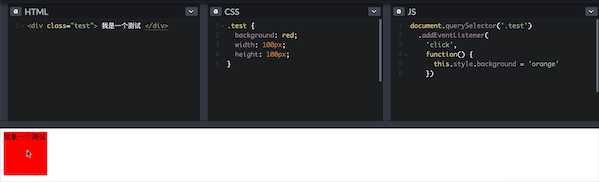
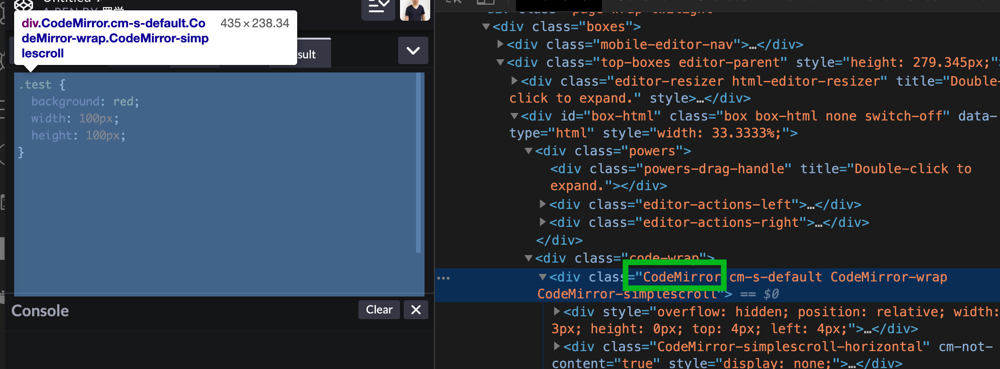
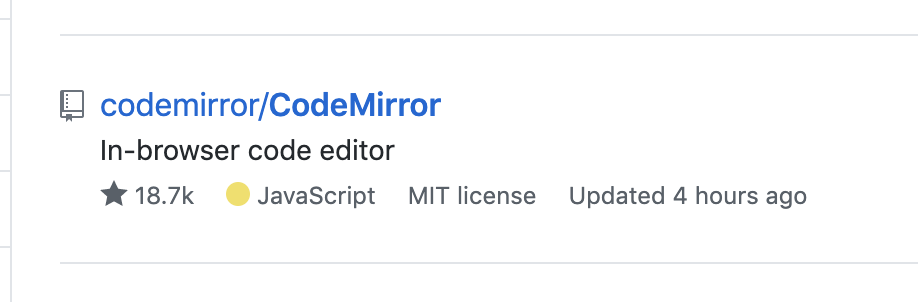

# 如何写一个代码编辑器

## 首先演示一下什么是代码编辑器



> 当我们看到这个编辑器的时候，你有没有好奇这是这么做出来的？如果是让你来做，你会怎么做？

## 闲扯

学无止境，我们现在的技术都是基于前一代人之上做出来的，要想成为一个高级/资深的前端，重点不是你能创造多少东西，而是你知道多少东西。有没有解决问题的能力。遇到问题能不能找到最优解，为公司减少成本的同时提升效率。系统性的解决问题，提高代码的维护性、稳定性、可扩展行等等。所以现代社会是一个认知的社会，只有不断的突破自己的认知，才能够成为更优秀的人。

最近在搞公众号，虽然公众号已经写了快两年了，但是一直没有推广过。最近打算推广，加了好多大佬的微信，我感觉我之前做的事情就是小巫见大巫，根本不值一提，前方还有好长的路要走，我隐隐感觉有点兴奋，因为只有迎难而上、才能迎刃而解。关注我公众号，前路漫漫，一起修行！

## 正题

当我们想做一个事情的时候，往往最难的不是做，而是不知道从哪做起，怎么做？我的每篇文章都会讲我是如何去一点点解决问题的，希望能够尽我的绵薄之力帮助有心之人。

1. 看到网站之后不要急着去百度，因为百度有太多无用的信息干扰你，而且这些无用的信息很可能会把你的注意力转移，最后忘了你为什么要百度！
2. 以 codepen 官网为例，我是如何去查他用了什么技术？ 

- 思考，这种编辑器的功能一定是有开源库的，因为好多网站都使用过，那么顺着思路走，找到这个开源库的名字，我们就完成一半了。
- 怎么找，首先右击打开检查，查看 Network 有没有有用的信息，比如加载了哪个js，在js源码中找到一些线索（一般都会被打包过了，找到的几率不大）。然后打开元素检查，查找 class  名称有没有一些蹊跷
- 为什么找 class ，因为 class 最能直观的找到表达者的意图



我们找到了一个很可疑的单词 CodeMirror

- 接下来去 github 上搜索一下 CodeMirror



果然被我们找到了，点进去查看他的用法。接下来你应该知道怎么做了～

## 动工

上面讲解的是我如何找工具的方法，我现在使用的不是 CodeMirror，但是我也是通过这种方法找到的。 我接下来用 monacoEditor 来讲解我的做法。

## 加载 monaco 脚本

这是一段加载 monaco 的js。主要逻辑就是 load 一段 js，将 monaco 注册到 window 上

```js
export default {
  // https://as.alipayobjects.com/g/cicada/monaco-editor-mirror/0.6.1/min/vs/loader.js
  load(srcPath = 'https://as.alipayobjects.com/g/cicada/monaco-editor-mirror/0.6.1/min', callback) {
    if (window.monaco) {
      callback();
      return;
    }
    const config = {
      paths: {
        vs: srcPath + '/vs'
      }
    };
    const loaderUrl = `${config.paths.vs}/loader.js`;
    const onGotAmdLoader = () => {
      if (window.LOADER_PENDING) {
        window.require.config(config);
      }
      
      window.require(['vs/editor/editor.main'], () => {
        callback();
      });

      // 当AMD加载器已被加载时调用延迟的回调
      if (window.LOADER_PENDING) {
        window.LOADER_PENDING = false;
        const loaderCallbacks = window.LOADER_CALLBACKS;
        if (loaderCallbacks && loaderCallbacks.length) {
          let currentCallback = loaderCallbacks.shift();
          while (currentCallback) {
            currentCallback.fn.call(currentCallback.window);
            currentCallback = loaderCallbacks.shift();
          }
        }
      }
    };

    if (window.LOADER_PENDING) {
      // 我们需要避免加载多个loader.js时
      // 有多个编辑器同时加载延迟调用回调除了第一个
      window.LOADER_CALLBACKS = window.LOADER_CALLBACKS || [];
      window.LOADER_CALLBACKS.push({
        window: this,
        fn: onGotAmdLoader
      });
    } else {
      if (typeof window.require === 'undefined') {
        const loaderScript = window.document.createElement('script');
        loaderScript.type = 'text/javascript';
        loaderScript.src = loaderUrl;
        loaderScript.addEventListener('load', onGotAmdLoader);
        window.document.body.appendChild(loaderScript);
        window.LOADER_PENDING = true;
      } else {
        onGotAmdLoader();
      }
    }
  }
}
```

## 封装组件

写一个组件将加载执行的逻辑封装在这个组件里，暴露出一些 api，提供给调用者使用

```HTML
<template>
  <div :style="style"></div>
</template>

<script>
import monacoLoader from './MonacoLoader'
const debounce = require('lodash.debounce');

export default {
  props: {
    // 编辑器的宽，默认 100%
    width: { type: [String, Number], default: '100%' },
    // 编辑器的高，默认 100%
    height: { type: [String, Number], default: '100%' },
    // 传进来的代码，一段字符串
    code: { type: String, default: '// code \n' },
    // 资源路径
    srcPath: { type: String },
    // 默认使用 js
    language: { type: String, default: 'javascript' },
    // 主题 默认 vs-dark
    theme: { type: String, default: 'vs-dark' }, // vs, hc-black
    // 一些 monaco 配置参数
    options: { type: Object, default: () => {} },
    // 截流
    changeThrottle: { type: Number, default: 0 }
  },
  // 加载资源
  created() {
    this.fetchEditor();
  },
  // 销毁
  destroyed() {
    this.destroyMonaco();
  },
  computed: {
    style() {
      const { width, height } = this;
      const fixedWidth = width.toString().indexOf('%') !== -1 ? width : `${width}px`;
      const fixedHeight = height.toString().indexOf('%') !== -1 ? height : `${height}px`;
      return {
        width: fixedWidth,
        height: fixedHeight,
      };
    },
    editorOptions() {
      return Object.assign({}, this.defaults, this.options, {
        value: this.code,
        language: this.language,
        theme: this.theme
      });
    }
  },
  data() {
    return {
      defaults: {
        selectOnLineNumbers: true,
        roundedSelection: false,
        readOnly: false,
        cursorStyle: 'line',
        automaticLayout: false,
        glyphMargin: true
      }
    }
  },
  methods: {
    editorHasLoaded(editor, monaco) {
      this.editor = editor;
      this.monaco = monaco;
      this.editor.onDidChangeModelContent(event =>
        this.codeChangeHandler(editor, event)
      );
      this.$emit('mounted', editor);
    },
    codeChangeHandler: function(editor) {
      if (this.codeChangeEmitter) {
        this.codeChangeEmitter(editor);
      } else {
        this.codeChangeEmitter = debounce(
          function(editor) {
            this.$emit('codeChange', editor);
          },
          this.changeThrottle
        );
        this.codeChangeEmitter(editor);
      }
    },
    fetchEditor() {
      monacoLoader.load(this.srcPath, this.createMonaco);
    },
    createMonaco() {
      this.editor = window.monaco.editor.create(this.$el, this.editorOptions);
      this.editorHasLoaded(this.editor, window.monaco);
    },
    destroyMonaco() {
      if (typeof this.editor !== 'undefined') {
        this.editor.dispose();
      }
    }
  }
};
</script>

```

## 完成

使用组件，将组件显示在页面上。并将 console.log 收集起来，执行完代码之后将其打印在屏幕上。

*最后会有演示*

```HTML
<template>
  <div>
    <MonacoEditor
      height="300"
      language="typescript"
      :code="code"
      :editorOptions="options"
      @codeChange="onCodeChange"
    ></MonacoEditor>
    <div class="console">{{ res }}</div>
  </div>
</template>
<script>
import MonacoEditor from '../../components/vue-monaco-editor';
let logStore = [];
export default {
  components: {
    MonacoEditor
  },
  data() {
    return {
      result: 'noop',
      // 默认 code
      code: 
`const noop = () => {
  console.log('noop')
}
noop()
`,
      options: {}
    };
  },
  methods: {
    clear() {
      this.result = '';
      logStore = [];
    },
    // 重写consolelog，并储存在logStore内
    overwriteConsoleLog() {
      console.log = function(...arg) {
        logStore.push(arg);
      };
    },
    // 抽象出一层修饰层
    modify(e) {
      if (typeof e === 'object') e = JSON.stringify(e);
      return e;
    },
    // 输出
    printf(oriConsole) {
      const _this = this
      logStore.forEach(item => {
        function str() {
          return item.map(_this.modify);;
        }
        oriConsole(str(item));
        this.result +=
          str(item)
            .join(' ') + '\n';
      });
      console.log = oriConsole;
    },
    onCodeChange(code) {
      // 保存 console.log 对象
      const oriConsole = console.log;
      // 清空副作用
      this.clear();
      // 重写 console.log，为了将控制台打印值输出在页面上
      this.overwriteConsoleLog();
      // 获取代码的片段字符串
      const v = code.getValue();
      try {
        // 执行代码
        eval(v);
        // 将控制台打印值输出在页面上
        this.printf(oriConsole)
      } catch (error) {
        console.error(error)
      }
    }
  }
};
</script>
<style lang="scss">
.editor {
  width: 100%;
  height: 100vh;
  margin-top: 50px;
}
.console {
  height: 500px;
  background: orange;
  font-size: 40px;
  white-space: pre-wrap;
}
</style>
```
## 效果演示


## 小结

又到了小结时刻，当我们看见一个很厉害的东西的时候，不要害怕，其实你也可以，大部分的功能其实已经被别人封装好了，我们都是站在巨人的肩膀上。

我会经常分享一些自己工作经验、技术体会、做的小玩意等等。更大家一起学习。

看别人十遍，不如自己动手写一遍，我的这些源码和文章都在这里，可以自己下载下来运行一下试试。

https://github.com/luoxue-victor/source-code/tree/master/src/views/monacoEditor

## 最后两件小事拜托大家

1. 有想入群的学习前端进阶的加我微信 luoxue2479 回复加群即可

2. 我的 github 地址，所有我的文章及源码都在这里，欢迎来star

> https://github.com/luoxue-victor/source-code

3. 我总结了一些 TODO，有兴趣的同学可以一起来

> https://github.com/luoxue-victor/source-code/issues