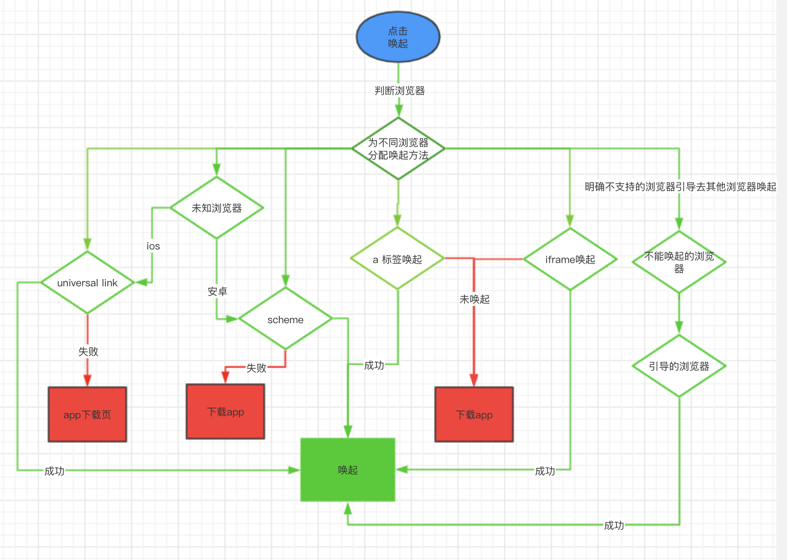

# 各种场景唤起 App 骚操作

> 唤起 App 应该是很常见的问题了。我们在开发 H5 的时候，有一些链路上的功能在 H5 不支持，只能去 App 才能完成。比如，下单、支付等功能。那么在更多的场景能够唤起 App 就显得很重要了。

## 几步走

1. 判断浏览器，动态加载对应浏览器的下载逻辑
2. 通过 `universal link`、`URL Scheme`、`a 标签`、`iframe` 几种方式找出最适合这个浏览器的唤起方式。
3. 如果下载了 App，就会走打开逻辑，如果没有下载则走下载逻辑。
4. 如果已知不能唤起的浏览器引导其它浏览器打开

## 流程：



## 各个唤起方法对比

> 没有哪种方式是完美的，每种唤起方式都有它的优势跟劣势，只有将所有的唤起方法在不同浏览器上尝试过才能择优使用。

### 通用链接（universal link）

> 通用链接 `universal link` 是 `IOS 9.0` 版本以上才可以使用的新的特性。此特性类似于深层链接，并能够方便地通过打开一个 `https` 链接来直接启动您的客户端应用(手机有安装 App)。对比起以往所使用的 `URL Scheme`, 这种新特性在实现 `web-app` 的无缝链接时能够提供极佳的用户体验。

#### 体验一下通用链接

我们可以来体验一下，左边的是通用链接 `universal link`方式，右边是 `URL Scheme` 方式。

左边可以直接将 App 打开，而右边需要确认是否打开才可以。


`解决的bug`：在 `ios 12.3` 版本之后，`Safari` 会有一个 bug，就是 `URL Scheme` 跟 `download App` 先后一起使用的话，会同时唤起 `App` 然后再进入 `App store`，体验极差。使用 `universal link` 可以完美解决这个问题。

#### 通用链接配置

必须在根目录下或者 域名/.well-known 下面。`注意` 域名不要使用业务域名添加配置文件，必须要跨域使用，否则会会不能唤起App，直接打开页面。

- `访问链接` 我们假设有三个 App，分别是 `appa`、`appb`、`appc`，我们通过访问 `https://jump.test.com/appa/index.html` 就可以唤起 `appa` 了。
- `配置下载页` 如果没有安装 `appa` 的话就会跳转到 一个 `404` 页面，因为我们这个页面 `https://jump.test.com/appa/index.html` 其实并不存在，所以我们需要将这个页面在 `nginx` 代理到一个下载页面。
- `疑问` 那么你可能有一个疑问，我如果唤起来 `app` 之后这个页面会不会跳转到下载页呢？答案是不会的，如果唤起了 app 就不会继续跳转页面了，只有在唤不起来的时候才会进入下载页。

#### apple-app-site-association 配置

```json
{
  "applinks": {
    "apps": [],
    "details": [
      {
        "appID": "ABCD.com.aaa.appa",
        "paths": ["appa/*"]
      },
      {
        "appID": "ABCD.com.aaa.appb",
        "paths": ["appb/*"]
      },
      {
        "appID": "ABCD.com.aaa.appc",
        "paths": ["appc/*"]
      },
      {
        "appID": "ABCD.com.aaa.*",
        "paths": ["*"]
      }
    ]
  }
}
```

#### 通用链接的优缺点：

- `优点`：提供极佳的用户体验，使用起来也非常方便，解决了同时唤起 `app` 跟 `app store` 的问题
- `缺点`：只有在 ios 9 版本之上才能使用，个别浏览器不支持有兼容性问题

### URL Scheme 方式

#### 用法

根据协议来判断是哪个 app 唤起。

```js
location.href = "testa://test.aaa.com/home";
```

#### 判断是否唤起 app

因为唤起 app 并没有回调让我们知道唤起了 app，所以我们只能通过监听页面是否隐藏来实现判断是否唤起 app 的逻辑。当然这种做法还是有很大缺陷的，比如低端机型唤起速度很慢，高端机型要快得多，所以 delay 的时间要设置一个可以接受的值，我们暂时定的是 2500。还有如果用户没有安装 app，也会有 2500 的延时才能安装。

```js
const timer = setTimeout(() => {
  this.__download(options);
}, options.delay);

const visibilitychange = function() {
  const tag = document.hidden || document.webkitHidden;
  tag && clearTimeout(timer);
};

document.addEventListener("visibilitychange", visibilitychange, false);
document.addEventListener("webkitvisibilitychange", visibilitychange, false);
window.addEventListener(
  "pagehide",
  function() {
    clearTimeout(timer);
  },
  false
);
```

#### URL Scheme 的优缺点：

- `优点` 1. 兼容性好，大部分机型都能兼容 2. 使用方便
- `缺点` 1. 不能判断是否已经下载了 app，需要自己写逻辑判断 2. 用户体验不如通用链接的方式。

### a 标签跟 iframe 方式

这两种方式都是通过创建元素，通过元素属性的特性来做的

#### a 标签

```js
const a = document.createElement("a");
a.setAttribute("href", __SCHEMA_PATH);
a.click();
```

#### iframe

```js
const ifr = document.createElement("iframe");
iframe.src = path;
ifr.src = nativeUrl;
ifr.style.cssText = "display:none;border:0;width:0;height:0;";
document.body.appendChild(ifr);
setTimeout(function() {
  document.body.removeChild(ifr);
}, 1000);
```

#### 优缺点

- `优点` 在个别场景中如果发现唤起 app 有问题，可以尝试这两种。
- `缺点` iframe 基本上已经被废弃了，a 标签测试结果只在个别机型中可用。

## 总结

1. `微信` 必须配置白名单，或者使用 universal link 也可以在 ios 唤起，表现形式有一点差别

```js
const wxconfig = {
  debug: false,
  appId: conf.appId, // 公众号的 appid
  timestamp: conf.timestamp,
  nonceStr: conf.noncestr,
  signature: conf.signature,
  beta: true,
  jsApiList: ["launchApplication", "getInstallState"]
};
(window.wx && window.wx.config(wxconfig)) || (window.wxconfig = wxconfig);
```

2. 百度浏览器必须用 `universal link` 方式才能在 IOS 唤起
3. qq 在 ios 要使用 `a 标签` 的方式，即使通用链接的方式也不能将其唤起

```js
if (isIOS) {
  const a = document.createElement("a");
  a.setAttribute("href", __SCHEMA_PATH);
  return a.click();
}
location.href = __SCHEMA_PATH;
```

4. 微博，测试京东跟淘宝都可以调起，猜测是设置了白名单，目前没有找到好的办法，只能引导到其它浏览器中打开

## 测试结果

目前只有微博不能唤起，其它都可以正常唤起

| 场景          | ios | 安卓 | 是否需要配置白名单 |
| ------------- | --- | ---- | ------------------ |
| 微信          | ✔️  | ✔️   | 是                 |
| qq            | ✔️  | ✔️   | 否                 |
| chrome        | ✔️  | ✔️   | 否                 |
| 小米 browser  | ✔️  | ✔️   | 否                 |
| uc            | ✔️  | ✔️   | 否                 |
| qq browser    | ✔️  | ✔️   | 否                 |
| 360 browser   | ✔️  | ✔️   | 否                 |
| 猎豹          | ✔️  | ✔️   | 否                 |
| sogou         | ✔️  | ✔️   | 否                 |
| baidu browser | ✔️  | ✔️   | 否                 |
| safari        | ✔️  | ✔️   | 否                 |
| 微博          | X   | X    | 是                 |

## 体验

`AD`：转转 App 是我们公司开发的 App，主要负责二手交易。可以通过下面的链接下载 `转转App` 来体验哦～

https://m.zhuanzhuan.com/common/pro_together_run_cli/index.html#/callApp

## 最后有两件小事

1. 有想入群的学习前端进阶的加我微信 `luoxue2479` 回复加群即可
2. 喜欢这篇文章的话，点个 `在看`，让更多的人看到
3. 有写错的地方和更好的建议可以在下面 `留言`，一起讨论