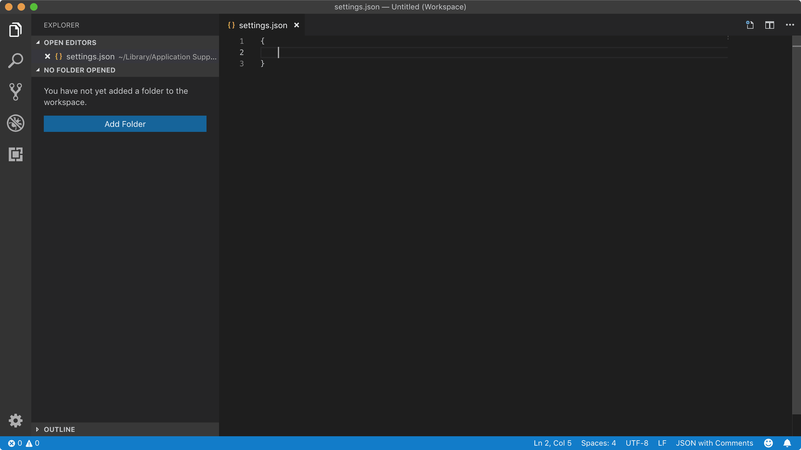

> - 作者：👊Badd
> - 链接：https://juejin.im/post/5cd8fcedf265da03761eaa45
> - 来源：掘金

## 推荐语

假设你已经用过一段时间的 VS Code 了。你已经更改了颜色主题（如果还没有，那我强烈推荐 material 主题），调整了基本设置，并且安装了一些流行的插件。

可能你感觉这种程度足以满足日常工作需求。这很棒，但这样你就很可能与 VS Code 的诸多功能擦肩而过了。

本文荟萃了一些设置、插件和窍门，它们都对我的 Web 开发工作有莫大帮助。

## jsconfig.json

VS Code 的基本功能中，jsconfig.json 是最容易被忽视的一个。当你在 VS Code 中打开 JS 项目，VS Code 并不知道项目中的文件是相关联的。它把每个文件当作单独个体。而通过在项目根目录创建 jsconfig.json 文件，你可以把项目信息传达给 VS Code。

jsconfig.json（连同其他配置一起）实现了“智能跳转到定义处”的功能，此中用到了各种模块解析算法。在实践过程中，你可以对代码中的各种引用使用组合键 ⌘ 点击，然后就能跳转到该引用定义之处。我强烈建议你读读官方文档，而我个人最常用的配置是这样的：

```js
{
  "compilerOptions": {
    "baseUrl": "src/",
    "target": "esnext",
    "module": "commonjs"
  },
  "exclude": [
    "node_modules",
  ]
}
```

## 配置入门

#### 注意：若你已经知道从何找到 VS Code 的设置，也知道如何编辑设置，就直接跳过本段吧。

VS Code 把配置信息放在一个类 JSON 格式（所谓的 jsonc —— 带注释模式的 JSON）的文件中。可以通过 ⌘ 键、快捷方式，或者 文件 > 首选项 > 设置 打开。（点击这里了解更多设置）

打开设置页面后，你不会直接看到源 JSON 文件。VS Code 精心优化了设置页面的界面，但本文出于便于分享的目的，将不使用该界面，而是以键值对的形式展现。

你可以通过点击标签栏上的 { } 按钮来打开 JSON 配置文件。

如果该文件是空的（你还没有针对默认设置做任何修改），那我们需要创建一个空对象，它得是有效的 JSON 格式：




