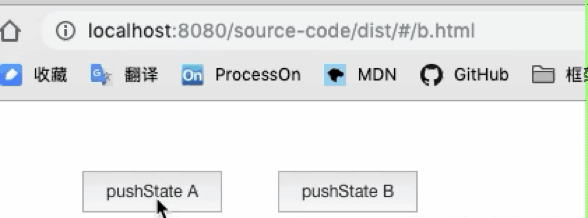
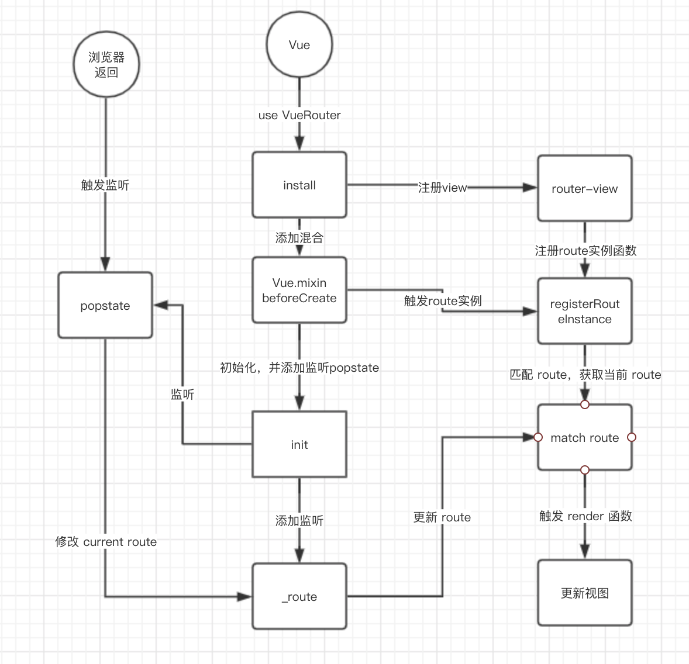
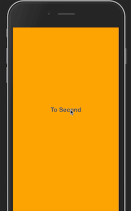

# vue-router从源码到实践到进阶


✅代表已经完成 

❎留到下期

## 目录

- ✅pushState/replaceState/popstate 解析
- ✅vue-router 实现原理
- ✅route 跟 router 的区别
- ✅通过路由元信息，设置登录
- ✅设置滚动行为
- ✅vue 路由 按需 keep-alive
- ✅watch 监听路由变化
- ✅如何检测物理键返回
- ✅如何做出翻书效果
- ✅如何做一个优雅的路由分区
- ❎根据目录实现自动生成路由
- ❎根据路由规则生成页面


> 先了解了浏览器的`history`原理，才能更好的结合`vue-router`源码一步步了解它的实现。如果这块已经有了解可以直接跳过。

## pushState/replaceState/popstate 解析

`HTML5`开始提供了对`history`栈中内容的操作。通过`history.pushState/replaceState`实现添加地址到`history`栈中。

### pushState/replaceState() 方法

> pushState() 需要三个参数: 一个状态对象, 一个标题 (目前被忽略), 和 (可选的) 一个URL. 让我们来解释下这三个参数详细内容：

- `状态对象` — 状态对象state是一个JavaScript对象，通过pushState () 创建新的历史记录条目。无论什么时候用户导航到新的状态，popstate事件就会被触发，且该事件的state属性包含该历史记录条目状态对象的副本。

  状态对象可以是能被序列化的任何东西。原因在于Firefox将状态对象保存在用户的磁盘上，以便在用户重启浏览器时使用，我们规定了状态对象在序列化表示后有640k的大小限制。如果你给 pushState() 方法传了一个序列化后大于640k的状态对象，该方法会抛出异常。如果你需要更大的空间，建议使用 sessionStorage 以及 localStorage.

- `标题` — Firefox 目前忽略这个参数，但未来可能会用到。在此处传一个空字符串应该可以安全的防范未来这个方法的更改。或者，你可以为跳转的state传递一个短标题。

- `URL` — 该参数定义了新的历史URL记录。注意，调用 pushState() 后浏览器并不会立即加载这个URL，但可能会在稍后某些情况下加载这个URL，比如在用户重新打开浏览器时。新URL不必须为绝对路径。如果新URL是相对路径，那么它将被作为相对于当前URL处理。新URL必须与当前URL同源，否则 pushState() 会抛出一个异常。该参数是可选的，缺省为当前URL。

改变历史记录条目

```js
@clickA
history.pushState({ page: 1 }, "", "a.html");

@clickB
history.pushState({ page: 2 }, "", "b.html");
```


### popstate

当历史记录条目更改时，将触发`popstate`事件。如果被激活的历史记录条目是通过对`history.pushState（）`的调用创建的，或者受到对`history.replaceState（）`的调用的影响，`popstate`事件的`state`属性包含历史条目的状态对象的副本。

需要注意的是调用`history.pushState()`或`history.replaceState()`不会触发`popstate`事件。只有在做出`浏览器动作`时，才会触发该事件，如用户点击浏览器的回退按钮（或者在`Javascript`代码中调用`history.back()`）

触发浏览器回退按钮

```js
window.addEventListener('popstate', ()=>{
  console.log(location.href)
})
```


## vue-router 实现原理

> 总体来说就是使用了`history`的方法来控制浏览器的路由，结合`vue`实现数据与视图更新。上面我们已经讲了`history`的使用原理，接下来结合`vue-router`具体来看一下

### 安装 vue-router

`install.js`

- 通过 `Object.defineProperty` 将 `_router` 挂载在 `Vue` 原型的 `$router` 属性的 `get` 函数上。这样可以通过 `this.$router` 来调用 `_router`。使用`get`的好处是，保证了安全性，只能读不能修改 `$router`。

```js
// 项目内可以通过 this.$router 来获取到
Object.defineProperty(Vue.prototype, '$router', {
  get () { return this._routerRoot._router }
})
```

然后，在 `Vue.mixin` 中注入 `beforeCreate` 钩子函数，每个组件都会调用 `registerInstance` ， 通过 `Vue.util.defineReactive` 将 `_route` 进行监听，这样每次进入到新的页面就会设置当前的路由。

```js
// 在 `beforeCreate` 中调用了 `registerInstance` 
// 其实就是调用了 router-view 组件中的 registerRouteInstance 方法
const registerInstance = (vm, callVal) => {
  let i = vm.$options._parentVnode
  if (isDef(i) && isDef(i = i.data) && isDef(i = i.registerRouteInstance)) {
    i(vm, callVal)
  }
}
Vue.mixin({
  beforeCreate () {
    if (isDef(this.$options.router)) {
      this._routerRoot = this
      this._router = this.$options.router
      // 初始化设置监听 popstate
      // 并将 this._route = route
      this._router.init(this)
      // 亮点在这！！！
      // 将 _route 添加监听，当修改 history.current 时就可以触发更新了
      Vue.util.defineReactive(this, '_route', this._router.history.current)
    } else {
      this._routerRoot = (this.$parent && this.$parent._routerRoot) || this
    }
    // 注册实例，调用 router-view 中的方法，修改 route 值，从而更新视图
    registerInstance(this, this)
  },
  destroyed () {
    // 销毁注册实例，因为注册的实例是 undefined
    registerInstance(this)
  }
})
```

### `router-view` 实现视图更新

`router-view` 是一个函数式组件，页面中 `beforeCreate` 钩子调用`registerRouteInstance` 来修改当前 `route` 实例，由于 `_route` 已经被监听了，所以当 `matched.instances[name]` 发生变化的时候，会重新触发 `render` 更新视图。

`omponents/view.js`

```js
data.registerRouteInstance = (vm, val) => {
  const current = matched.instances[name]
  // 注册路由实例，如果与当前路由与原来路由相等则不变，如果不相等则更新实例
  if (
    (val && current !== vm) ||
    (!val && current === vm)
  ) {
    // 修改当前路由实例
    matched.instances[name] = val
  }
}
```

### 创建 route 对象

创建路由 `createRoute`，通过解析`location`等操作，返回一个`route`对象

`src/util/route.js`

```js
export function createRoute (
  record: ?RouteRecord,
  location: Location,
  redirectedFrom?: ?Location,
  router?: VueRouter
): Route {
  const stringifyQuery = router && router.options.stringifyQuery

  let query: any = location.query || {}
  try {
    query = clone(query)
  } catch (e) {}

  const route: Route = {
    name: location.name || (record && record.name),
    meta: (record && record.meta) || {},
    path: location.path || '/',
    hash: location.hash || '',
    query,
    params: location.params || {},
    fullPath: getFullPath(location, stringifyQuery),
    matched: record ? formatMatch(record) : []
  }
  if (redirectedFrom) {
    route.redirectedFrom = getFullPath(redirectedFrom, stringifyQuery)
  }
  return Object.freeze(route)
}
```

> 这里主要讲了，`vue-router` 的 `install`，`router-view` 实现视图渲染，`create-route` 创建路由实例，还有如何实现与vue的结合，实现数据绑定等。由于篇幅的问题，再多细节的东西就没有讲了，有兴趣大家可以翻翻源码。



## route 跟 router 的区别

讲完原理给大家捋一下 route 跟 router 的区别，通过源码很容易看出他们的不同

- `$router` 是router是VueRouter的一个对象，通过Vue.use(VueRouter)和VueRouter构造函数得到一个router的实例对象，这个对象中是一个全局的对象，他包含了所有的路由包含了许多关键的对象和属性。

- $route 就是一个路由的对象，我们通过 createRoute 创建出来的 route 对象，里面包括

`$route.path` 

字符串，等于当前路由对象的路径，会被解析为绝对路径，如 "/home/news" 。

`$route.params `

对象，包含路由中的动态片段和全匹配片段的键值对

`$route.query` 

对象，包含路由中查询参数的键值对。例如，对于 /home/news/detail/01?favorite=yes ，会得到$route.query.favorite == 'yes' 。

`$route.router` 

路由规则所属的路由器（以及其所属的组件）。

`$route.matched` 

数组，包含当前匹配的路径中所包含的所有片段所对应的配置参数对象。

`$route.name` 

当前路径的名字，如果没有使用具名路径，则名字为空。

## 通过路由元信息，设置登录

原理是在路由的 `meta` 里设置 `auth` 属性，进入路由之前判断 `meta.auth` 是否为 `true` ，如果为 `true` 再判断，是否已经登陆，没有登陆的话调 `login` 方法去登陆，登陆成功后 回调 `code === 0` 继续进入页面

```js
const beforeEnter = (to, from, next) => {
  if (to.meta && to.meta.auth) {
    // 未登陆走登陆逻辑
    if (!isLogin()) {
      const nextPage = (res) => {
        if (res.code === 0) {
          next(true)
        } else {
          next(false)
        }
      };
      let targetUrl = location.href.split('#')[0] + '#' + to.fullPath
      // 这里是你的登陆逻辑
      login({
        // 回调后进入页面
        callback: nextPage, 
        // 目标页面，登陆成功后进入目标页面
        targetUrl: targetUrl 
      });
    } else {
      next(true)
    }
  } else {
    next(true)
  }
}
```

在 Foo 组件设置登陆

```js
const routes = [
  {
    path: '/Foo',
    name: 'Foo',
    meta: {
      auth: true,
    },
    component: () => ('Foo.vue'),
  },
  {
    path: '/Bar',
    name: 'Bar',
    component: () => ('Bar.vue'),
  },
]
```
## 设置滚动行为

设置滚动行为，并添加路由，如果有 `savedPosition` 说明是第二次进入并已经触发过滚动，所以会滚动到之前打开的位置，如果是第一次进入没有`savedPosition`则滚动到最顶层。

```js
const router = new Router({
  scrollBehavior(to, from, savedPosition) {
    if (savedPosition) {
      return savedPosition
    } else {
      return { x: 0, y: 0 }
    }
  },
  routes
})
```

## vue 路由 按需 keep-alive

`<keep-alive>` 包裹动态组件时，会缓存不活动的组件实例，而不是销毁它们。和 `<transition>` 相似，`<keep-alive>` 是一个抽象组件：它自身不会渲染一个 `DOM` 元素，也不会出现在父组件链中。

当组件在 `<keep-alive>` 内被切换，它的 `activated` 和 `deactivated` 这两个生命周期钩子函数将会被对应执行。

```html
<!-- 需要缓存的视图组件 -->
<router-view v-if="$route.meta.keepAlive">
  </router-view>
</keep-alive>

<!-- 不需要缓存的视图组件 -->
<router-view v-if="!$route.meta.keepAlive">
</router-view>
```

路由配置

```js
const routers = [
  {
    path: '/list',
    name: 'list',
    component: () => import('./views/keep-alive/list.vue'),
    meta: {
      keepAlive: true
    }
  }
]
```

因为在我们项目里面经常会有列表跳详情，然后又详情返回列表的情况，所以我们可以根据项目需求来判断是否需要被缓存，如果被缓存了就会出现下面的情况需要注意

## watch 监听路由变化

有时我们需要通过给页面传参来判断页面展示什么内容，比如详情页 `#/detail?infoId=123456`，我们需要根据 `infoId` 来展示不同的内容

我们一般习惯会这样写

```js
async created() {
  const res = await this.pullData()
}

async pullData () {
  return this.$http.get('http://test.m.com/detail', { infoId })
}
```

当我们通过列表再次进入详情页时，虽然`infoId`已经变了`infoId=234567`，但是页面并没有改变，是因为该页面被`keep-alive`了，`created`不会再次触发，`created`只在创建的时候执行一次。

为了解决这个问题，我们就需要对 `$route` 进行监听，只要 `route` 发生变化我们就更新页面

```js
watch: {
  '$route': {
    // 页面初始化时立即触发一次
    immediate: true,
    handler(to, from) {
      // 只有进入当前页面的时候，拉取数据
      if(to.path === '/detail') {
        this.pullData();
      }
    }
  }
}
```

这样还会带来下面的问题，就是物理键返回的时候也会刷新页面，下面是对物理键返回的处理

## 如何检测物理键返回

为什么要检测物理返回键？比如你有这样列表页，点击进去是一个是一个详情页，然后返回的时候列表刷新了，找不到原来的位置，这种时候对用户的体验非常不好。我们看一下例子。


`那么我们如何去优化它？`思路就是在用户返回到列表页的时候不刷新数据，只有在用户主动进入列表的时候才会刷新数据，我们看一下效果


下面是实现的代码，原理就是监听 `popstate`，当浏览器返回的时候会触发 `popstate`，这时我们标记 `isBack` 为 `ture`。在 `setTimeout 0` 之后判断 `isBack`（是否为浏览器返回），如果不是浏览器返回的再刷新数据。

```js
@Component
export default {
  data() {
    return {
      // 用来判断是否是通过返回键返回的
      isBack: false
    }
  },
  created () {
    // 如果是物理键返回的就设置 isBack = true
    this.$_onBack(()=>{
      this.isBack = true;
    });
  },
  watch: {
    '$route': {
      immediate: true,
      handler(to, from) {
        // 每次进入路由重置 isBack = false
        this.isBack = false;
        if(to.path === '/list') {
          // 等待路由的 popstate 监听结束
          setTimeout(()=>{
            !this.isBack && this.pullData();
          })
        }
      }
    }
  }
}
```
`_onBack 实现`，就是监听了 `popstate` ，因为`vue-router`是操作了`history`的状态，而浏览器返回的时候就会触发 popstate ，利用这个特性来判断是否为浏览器返回键返回

```js
_onBack(cb) {
  window.addEventListener(
    "popstate",
    (e) => {
      if(typeof cb  === 'function') {
        if(e.state) {
          cb(true)
        }
      }
    },
    false
  );
};
```

## 如何做出翻书效果

利用的是 `vue` 的 `transition` 组件，结合 `vue-router`，在路由上做一些过渡效果。先看图说话



```html
<template>
  <div class="wrap">
    <transition :name="transitionName">
      <router-view class="child-view"></router-view>
    </transition>
  </div>
</template>
<script>

export default {
  data() {
    return {
      transitionName: 'turning-down'
    }
  },
  watch: {  
    '$route' (to, from) {  
      if(to.path > from.path) {
        // 进入下一页
        this.transitionName = 'turning-up';  
      }else{  
        // 返回上一页
        this.transitionName = 'turning-down';  
      }
    }
  }
}
</script>

<style scoped lang="scss">
.child-view {  
  position: absolute;  
  left: 0;
  top: 0;
  width: 100%;
  height: 100%;  
  transition: all 4s ease;
  transform-origin: 0% center;
}

.turning-down-enter{
  opacity: 1;
  transform-origin: left;
  transform-style: preserve-3d;
  -webkit-transform: perspective(1000px) rotateY(-180deg);
  transform: perspective(1000px) rotateY(-180deg);
}

.turning-up-leave-active {
  transform-style: preserve-3d;
  transform: perspective(1000px) rotateY(-180deg);
  z-index: 100;
}
</style>
```
配置路由

```js
export default [
  {
    path: '/Home',
    name: 'home',
    component: () =>
      import('../views/vue/vue-router/Home.vue'),
    children: [
      {
        path: '/Home/First',
        name: 'Home-First',
        component: () =>
          import('../views/vue/vue-router/First.vue'),
      },
      {
        path: '/Home/Second',
        name: 'Home-Second',
        component: () =>
          import('../views/vue/vue-router/Second.vue'),
      }
    ]
  }
]
```

通过监听 `Home` 页面的路由变化，来改变 `transitionName`，路由切换时切换 `transition` 组件的 `enter/leave-active` 样式，因此可以在路由切换时做到翻书效果。

## 如何做一个优雅的路由分区

随着项目的增大，项目中的页面可能达到好几十个，甚至更多，那么如何将这些页面进行管理呢？我们的做法就是，将路由按照功能进行区分。

比如我们分了5个区间，每个区间有个数不同的路由

```js
-- a.js
-- b.js
-- c.js
-- d.js
-- e.js
```

我们需要将这五个路由分别引进来，并进行结合

```js
import a from 'routers/a'
import b from 'routers/b'
import c from 'routers/c'
import d from 'routers/d'
import e from 'routers/e'

const routers = [].concat(a, b, c, d, e)
```

以后我们每次建一个新的分区，都要手动加上相应的逻辑，这样看起来很不方便，那么我们有没有好的解决办法呢？

下面是我做的路由分区，利用 `webpack` 的 `require.context` 方法，将所有需要的路径导出来，`require.context` 有三个参数

- `第一个参数`，匹配的路径目录，（从当前目录开始算起）
- `第二个参数`，是否需要深层遍历
- `第三个参数`，正则匹配，匹配出你需要的路径

**需要注意的点，`require` 不能直接导出变量名**

例如，下面的例子会报错

```js
const a = './route/a.js'
// 会报错，a 不是一个模块
require(a)
```

所以 `require` 中只能加字符串或者使用字符串拼接

```js
const a = 'a.js'
require('./route/' + a)
```

这样webpack会把 `./route/` 下所有文件打包成模块，你才可以使用 `require` 去引用

下面是一个完成的例子

```js
import Vue from 'vue'
import Router from 'vue-router'

Vue.use(Router)

const routes = []
const context = require.context('./router', true, /\/[\w]+\.(js|ts)$/)

context.keys().forEach(_ => {
  const path = _.replace('./', '')
  routes.push(...require('./router/' +  path).routes)
})

export default new Router({
  routes: [
    { path: '/', redirect: '/Home' },
    ...routes
  ]
})
```

参考文章


https://juejin.im/post/5cdcbae9e51d454759351d84

https://segmentfault.com/a/1190000018173547?utm_source=tag-newest

https://www.cnblogs.com/czy960731/p/9288830.html