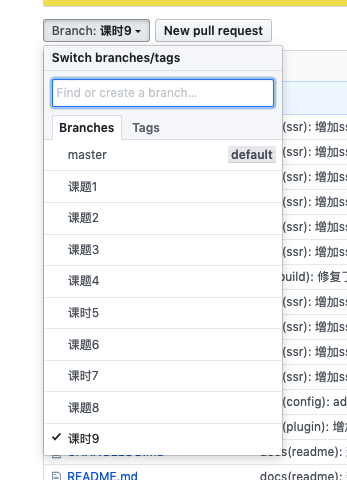

# 一步步从零开始 webpack 搭建一个大型项目

## 开篇

> 很多人都或多或少使用过 webpack，但是很少有人能够系统的学习 webpack 配置，遇到错误的时候就会一脸懵，不知道从哪查起？性能优化时也不知道能做什么，网上的优化教程是不是符合自己的项目？等一系列问题！本文从最基础配置一步步到一个完善的大型项目的过程。让你对 webpack 再也不会畏惧，让它真正成为你的得力助手！

本文从下面几个课题来实现

- 课题 1：<a href="#0_1">初探 webpack？探究 webpack 打包原理</a>
- 课题 2：<a href="#0_2">搭建开发环境跟生产环境</a>
- 课题 3：<a href="#0_3">基础配置之loader</a>
- 课时 4：<a href="#0_4">webpack性能优化</a>
- 课时 5：<a href="#0_5">手写loader实现可选链</a>
- 课时 6：<a href="#0_6">webpack编译优化</a>
- 课时 7：<a href="#0_7">多页面配置</a>
- 课时 8：<a href="#0_8">手写一个webpack插件</a>
- 课时 9：<a href="#0_9">构建 ssr</a>
### 项目地址

https://github.com/luoxue-victor/learn_webpack/

我把每一课都切成了不同的分支，大家可以根据课时一步步学习




### 脚手架

```js
npm i -g webpack-box
```

### 使用

```bash
webpack-box dev   # 开发环境
webpack-box build # 生产环境
webpack-box dll   # 编译差分包
webpack-box dev index   # 指定页面编译（多页面）
webpack-box build index # 指定页面编译（多页面）
webpack-box build index --report # 开启打包分析
webpack-box build:ssr  # 编译ssr
webpack-box ssr:server # 在 server 端运行
```

在 package.json 中使用

```json
{
  "scripts": {
    "dev": "webpack-box dev",
    "build": "webpack-box build",
    "dll": "webpack-box dll",
    "build:ssr": "webpack-box build:ssr",
    "ssr:server": "webpack-box ssr:server"
  }
}
```
使用

```bash
npm run build --report # 开启打包分析
```

扩展配置 

box.config.js

```js
module.exports = function (config) {
  /**
   * @param {object} dll 开启差分包
   * @param {object} pages 多页面配置 通过 box run/build index 来使用
   * @param {function} chainWebpack 
   * @param {string} entry 入口
   * @param {string} output 出口  
   * @param {string} publicPath 
   * @param {string} port 
   */
  return {
    entry: 'src/main.js',
    output: 'dist',
    publicPath: '/common/',
    port: 8888,
    dll: {
      venders: ['vue', 'react']
    },
    pages: {
      index: {
        entry: 'src/main.js',
        template: 'public/index.html',
        filename: 'index.html',
      },
      index2: {
        entry: 'src/main.js',
        template: 'public/index2.html',
        filename: 'index2.html',
      }
    },
    chainWebpack(config) {
    }
  }
}
```

------------

## <a name="0_1">课题 1:初探 webpack？探究 webpack 打包原理</a>

想要学好 `webpack`，我们首先要了解 `webpack` 的机制，我们先从js加载css开始学习。

我们从下面这个小练习开始走进 `webpack` 吧

在 `index.js` 中引入 `index.css`

```js
const css = require('./index.css')
console.log(css)
```

css 文件并不能被 js 识别，webpack 也不例外，上述的写法不出意外会报错

我们如何让 webpack 识别 css 呢，答案就在 webpack 给我们提供了 loader 机制，可以让我们通过loader 将任意的文件转成 webpack 可以识别的文件

本章主要讲解

1. <a href="#1_1">webpack 基础配置</a>
2. <a href="#1_2">解析 bundle 如何加载模块</a>
3. <a href="#1_3">动态 import 加载原理</a>
4. <a href="#1_4">使用 webpack-chain 重写配置</a>
5. <a href="#1_5">课时 1 小结</a>

###  <a name="1_1">webpack 基础配置</a>

#### 需要的依赖包

package.json

```json
{
  "scripts": {
    "dev": "cross-env NODE_ENV=development webpack", // 开发环境
    "build": "cross-env NODE_ENV=production webpack" // 生产环境
  },
  "dependencies": {
    "cross-env": "^6.0.3", // 兼容各种环境
    "css-loader": "^3.2.0",
    "rimraf": "^3.0.0", // 删除文件
    "webpack": "^4.41.2"
  },
  "devDependencies": {
    "webpack-cli": "^3.3.10"
  }
}
```

#### webpack 基础配置

webpack.config.js

```js
const path = require('path');
const rimraf = require('rimraf');

// 删除 dist 目录
rimraf.sync('dist');

// webpack 配置
module.exports = {
  entry: './src/index',
  mode: process.env.NODE_ENV,
  output: {
    filename: 'bundle.js',
    path: path.resolve(__dirname, 'dist')
  }
};
```

#### css 引入到 js

src/index.js

```js
const css = require('css-loader!./index.css');
const a = 100;
console.log(a, css);
```

#### 测试 css

src/index.css

```css
body {
  width: 100%;
  height: 100vh;
  background-color: orange;
}
```

### <a name="1_2">解析 bundle 如何加载模块</a> 

我删掉了一些注释跟一些干扰内容，这样看起来会更清晰一点

- `bundle` 是一个立即执行函数，可以认为它是把所有模块捆绑在一起的一个巨型模块。
- `webpack` 将所有模块打包成了 `bundle` 的依赖，通过一个对象注入
- `0 模块` 就是入口
- `webpack` 通过 `__webpack_require__` 引入模块
- `__webpack_require__` 就是我们使用的 `require`，被 `webpack` 封装了一层

dist/bundle.js

```js
(function(modules) {
  function __webpack_require__(moduleId) {
    if (installedModules[moduleId]) {
      return installedModules[moduleId].exports;
    }
    var module = (installedModules[moduleId] = {
      i: moduleId,
      l: false,
      exports: {}
    });

    modules[moduleId].call(
      module.exports,
      module,
      module.exports,
      __webpack_require__
    );

    module.l = true;

    return module.exports;
  }
  return __webpack_require__((__webpack_require__.s = 0));
})({
  './src/index.js': function(module, exports, __webpack_require__) {
    eval(`
      const css = __webpack_require__("./src/style/index.css")
      const a = 100;
      console.log(a, css)
    `);
  },

  './src/style/index.css': function(module, exports, __webpack_require__) {
    eval(`
      exports = module.exports = __webpack_require__("./node_modules/css-loader/dist/runtime/api.js")(false);
      exports.push([module.i, "body {
        width: 100%;
        height: 100vh;
        background-color: orange;
      }", ""]);
    `);
  },

  0: function(module, exports, __webpack_require__) {
    module.exports = __webpack_require__('./src/index.js');
  }
});
```

### <a name="1_3">动态 import 加载原理</a> 

如果我们把 index.js 的 require 改成 import 会发生什么？

我们知道 `import` 跟 `require` 的区别是，`import` 是动态加载只有在用到的时候才会去加载，而 `require` 只要声明了就会加载，`webpack` 遇到了 `require` 就会把它当成一个模块加载到 `bundle` 的依赖里

那么问题来了，如果我们使用了 import 去引用一个模块，它是如何加载的呢？

#### require 改成 import()

src/index.js

```js
// const css = require('css-loader!./index.css');
const css = import('css-loader!./index.css');
const a = 100;
console.log(a, css);
```

#### 动态加载打包结果

除了正常的 `bundle` 之外，我们还可以看见一个 `0.boundle.js`

`0.boundle.js` 就是我们的动态加载的 `index.css` 模块

```js
|-- bundle.js
|-- 0.boundle.js
```

#### 动态模块

0.boundle.js

这个文件就是把我们 `import` 的模块放进了一个单独的 `js` 文件中

```js
(window['webpackJsonp'] = window['webpackJsonp'] || []).push([
  [0],
  {
    './node_modules/css-loader/dist/runtime/api.js': function(
      module,
      exports,
      __webpack_require__
    ) {
      'use strict';
      eval(`
        ...
      `);
    },

    './src/style/index.css': function(module, exports, __webpack_require__) {
      eval(`
        exports = module.exports = __webpack_require__("./node_modules/css-loader/dist/runtime/api.js")(false));
        exports.push([module.i, \`body {
          width: 100%;
          height: 100vh;
          background-color: orange;
        },"\`]
      `);
    }
  }
]);
```

#### 动态模块加载逻辑

我们再看下 dist/bundle.js

方便理解，我把大部分代码和注释都删掉了

原理很简单，就是利用的 jsonp 的实现原理加载模块，只是在这里并不是从 server 拿数据而是从其他模块中

1. 调用模块时会在 `window` 上注册一个 `webpackJsonp` 数组，window['webpackJsonp'] = window['webpackJsonp'] || []
2. 当我们 `import`时，`webpack` 会调用 `__webpack_require__.e(0)` 方法，也就是 `requireEnsure`
3. `webpack` 会动态创建一个 `script` 标签去加载这个模块，加载成功后会将该模块注入到 `webpackJsonp` 中
4. `webpackJsonp.push` 会调用 `webpackJsonpCallback` 拿到模块
5. 模块加载完（then）再使用 `__webpack_require__` 获取模块

```js
(function(modules) {
  function webpackJsonpCallback(data) {
    var chunkIds = data[0];
    var moreModules = data[1];
    var moduleId,
      chunkId,
      i = 0,
      resolves = [];
    for (; i < chunkIds.length; i++) {
      chunkId = chunkIds[i];
      if (
        Object.prototype.hasOwnProperty.call(installedChunks, chunkId) &&
        installedChunks[chunkId]
      ) {
        resolves.push(installedChunks[chunkId][0]);
      }
      // 模块安装完
      installedChunks[chunkId] = 0;
    }
    for (moduleId in moreModules) {
      if (Object.prototype.hasOwnProperty.call(moreModules, moduleId)) {
        modules[moduleId] = moreModules[moduleId];
      }
    }
    if (parentJsonpFunction) parentJsonpFunction(data);
    while (resolves.length) {
      // 执行所有 promise 的 resolve 函数
      resolves.shift()();
    }
  }

  function jsonpScriptSrc(chunkId) {
    return __webpack_require__.p + '' + ({}[chunkId] || chunkId) + '.bundle.js';
  }

  function __webpack_require__(moduleId) {
    // ...
  }

  __webpack_require__.e = function requireEnsure(chunkId) {
    var promises = [];
    // ...
    var script = document.createElement('script');
    var onScriptComplete;
    script.charset = 'utf-8';
    script.timeout = 120;
    script.src = jsonpScriptSrc(chunkId);

    onScriptComplete = function(event) {
      // 处理异常，消除副作用
      // ...
    };
    var timeout = setTimeout(function() {
      onScriptComplete({ type: 'timeout', target: script });
    }, 120000);
    script.onerror = script.onload = onScriptComplete;
    document.head.appendChild(script);
    // ...
    // 动态加载模块
    return Promise.all(promises);
  };

  var jsonpArray = (window['webpackJsonp'] = window['webpackJsonp'] || []);
  // 重写数组 push 方法
  jsonpArray.push = webpackJsonpCallback;
  jsonpArray = jsonpArray.slice();
  for (var i = 0; i < jsonpArray.length; i++)
    webpackJsonpCallback(jsonpArray[i]);

  return __webpack_require__((__webpack_require__.s = 0));
})({
  './src/index.js': function(module, exports, __webpack_require__) {
    eval(`
        const css = __webpack_require__.e(0).then(__webpack_require__.t.bind(null, "./src/style/index.css", 7))
        const a = 100;
        console.log(a, css)
      `);
  },
  0: function(module, exports, __webpack_require__) {
    eval(`module.exports = __webpack_require__("./src/index.js");`);
  }
});
```

### <a name="1_4">使用 webpack-chain 重写配置</a>

我们用 webpack-chain 来写 webpack 的配置，原因是 webpack-chain 的方式更加灵活

官方解释

> `webpack-chain` 尝试通过提供可链式或顺流式的 `API` 创建和修改 `webpack` 配置。`API` 的 `Key` 部分可以由用户指定的名称引用，这有助于跨项目修改配置方式的标准化。

```js
const path = require('path');
const rimraf = require('rimraf');
const Config = require('webpack-chain');
const config = new Config();
const resolve = src => {
  return path.join(process.cwd(), src);
};

// 删除 dist 目录
rimraf.sync('dist');

config
  // 入口
  .entry('src/index')
  .add(resolve('src/index.js'))
  .end()
  // 模式
  // .mode(process.env.NODE_ENV) 等价下面
  .set('mode', process.env.NODE_ENV)
  // 出口
  .output.path(resolve('dist'))
  .filename('[name].bundle.js');

config.module
  .rule('css')
  .test(/\.css$/)
  .use('css')
  .loader('css-loader');

module.exports = config.toConfig();
```

### <a name="1_5">课时 1 小结</a>

至此课时 1 已经结束了，我们主要做了以下事情

1. webpack 基础配置
2. 将 css 通过 css-loader 打包进 js 中
3. 解析 bundle 如何加载模块的
4. webpack 如何实现的动态加载模块

学习一个工具我们不仅要看懂它的配置，还要对它的原理一起了解，只有学到框架的精髓，我们才能应对如今大前端如此迅猛的发展。

-------

## <a name="0_2">课题 2：搭建开发环境跟生产环境</a>

本章提要：

- <a href="#2_1">目录</a>
- <a href="#2_2">实现可插拔配置</a>
- <a href="#2_3">构建生产环境</a>
- <a href="#2_4">构建开发环境（devServer）</a>
- <a href="#2_5">提取 css</a>
- <a href="#2_6">自动生成 html</a>
- <a href="#2_7">项目测试</a>

### <a name="2_1">目录</a>

```js
│── build
│   │── base.js                 // 公共部分
│   │── build.js
│   └── dev.js
│── config
│   │── base.js                 // 基础配置
│   │── css.js                  // css 配置
│   │── HtmlWebpackPlugin.js    // html 配置
│   └── MiniCssExtractPlugin.js // 提取css
│── public                      // 公共资源
│   └── index.html              // html 模版
└── src                         // 开发目录
    │── style
    │ └── index.css
    └── main.js                // 主入口
```

### <a name="2_2">实现可插拔配置</a>

package.json

```json
{
  "scripts": {
    "dev": "cross-env NODE_ENV=development node build/dev.js",
    "build": "cross-env NODE_ENV=production node build/build.js"
  },
  "dependencies": {
    "cross-env": "^6.0.3",
    "css-loader": "^3.2.0",
    "cssnano": "^4.1.10",
    "ora": "^4.0.3",
    "rimraf": "^3.0.0",
    "webpack": "^4.41.2"
  },
  "devDependencies": {
    "extract-text-webpack-plugin": "^3.0.2",
    "html-webpack-plugin": "^3.2.0",
    "mini-css-extract-plugin": "^0.8.0",
    "vue-cli-plugin-commitlint": "^1.0.4",
    "webpack-chain": "^6.0.0",
    "webpack-cli": "^3.3.10",
    "webpack-dev-server": "^3.9.0"
  }
}
```

build/base.js

```js
const { findSync } = require('../lib');
const Config = require('webpack-chain');
const config = new Config();
const files = findSync('config');
const path = require('path');
const resolve = p => {
  return path.join(process.cwd(), p);
};

module.exports = () => {
  const map = new Map();

  files.map(_ => {
    const name = _.split('/')
      .pop()
      .replace('.js', '');
    return map.set(name, require(_)(config, resolve));
  });

  map.forEach(v => v());

  return config;
};
```

### <a name="2_3">构建生产环境</a>

build/build.js

```js
const rimraf = require('rimraf');
const ora = require('ora');
const chalk = require('chalk');
const path = require('path');
// 删除 dist 目录
rimraf.sync(path.join(process.cwd(), 'dist'));

const config = require('./base')();
const webpack = require('webpack');
const spinner = ora('开始构建项目...');
spinner.start();

webpack(config.toConfig(), function(err, stats) {
  spinner.stop();
  if (err) throw err;
  process.stdout.write(
    stats.toString({
      colors: true,
      modules: false,
      children: false,
      chunks: false,
      chunkModules: false
    }) + '\n\n'
  );

  if (stats.hasErrors()) {
    console.log(chalk.red('构建失败\n'));
    process.exit(1);
  }

  console.log(chalk.cyan('build完成\n'));
});
```

### <a name="2_4">构建开发环境（devServer）</a>

build/dev.js

```js
const config = require('./base')();
const webpack = require('webpack');
const chalk = require('chalk');
const WebpackDevServer = require('webpack-dev-server');
const port = 8080;
const publicPath = '/common/';

config.devServer
  .quiet(true)
  .hot(true)
  .https(false)
  .disableHostCheck(true)
  .publicPath(publicPath)
  .clientLogLevel('none');

const compiler = webpack(config.toConfig());
// 拿到 devServer 参数
const chainDevServer = compiler.options.devServer;
const server = new WebpackDevServer(
  compiler,
  Object.assign(chainDevServer, {})
);

['SIGINT', 'SIGTERM'].forEach(signal => {
  process.on(signal, () => {
    server.close(() => {
      process.exit(0);
    });
  });
});
// 监听端口
server.listen(port);

new Promise(() => {
  compiler.hooks.done.tap('dev', stats => {
    const empty = '    ';
    const common = `App running at:
    - Local: http://127.0.0.1:${port}${publicPath}\n`;
    console.log(chalk.cyan('\n' + empty + common));
  });
});
```

### <a name="2_5">提取 css</a>

config/css.js

#### css 提取 loader 配置

```js
module.exports = (config, resolve) => {
  return (lang, test) => {
    const baseRule = config.module.rule(lang).test(test);
    const normalRule = baseRule.oneOf('normal');
    applyLoaders(normalRule);
    function applyLoaders(rule) {
      rule
        .use('extract-css-loader')
        .loader(require('mini-css-extract-plugin').loader)
        .options({
          publicPath: './'
        });
      rule
        .use('css-loader')
        .loader('css-loader')
        .options({});
    }
  };
};
```

#### css 提取插件 MiniCssExtractPlugin

config/MiniCssExtractPlugin.js

```js
const MiniCssExtractPlugin = require('mini-css-extract-plugin');

module.exports = (config, resolve) => {
  return () => {
    config
      .oneOf('normal')
      .plugin('mini-css-extract')
      .use(MiniCssExtractPlugin);
  };
};
```

###  <a name="2_6">自动生成 html</a>

config/HtmlWebpackPlugin.js

```js
const HtmlWebpackPlugin = require('html-webpack-plugin');

module.exports = (config, resolve) => {
  return () => {
    config.plugin('html').use(HtmlWebpackPlugin, [
      {
        template: 'public/index.html'
      }
    ]);
  };
};
```

### <a name="2_7">项目测试</a>

#### 测试 html 模板

public/index.html

```html
<!DOCTYPE html>
<html>
  <head>
    <meta charset="UTF-8">
    <title>learn_webpack</title>
  <body></body>
</html>
```

#### 测试 css 模板

src/style/index.css

```css
.test {
  width: 200px;
  height: 200px;
  color: red;
  background-color: orange;
}
```

#### 程序入口

src/main.js

```js
require('./style/index.css');

const h2 = document.createElement('h2');
h2.className = 'test';
h2.innerText = 'test';
document.body.append(h2);
```

-------------------------------------------------------

## <a name="0_3">课题 3：基础配置之loader</a>

本章提要：

- <a href="#3_1">配置 babel</a>
- <a href="#3_2">使用 babel 配置 ts</a>
- <a href="#3_3">ts 静态类型检查</a>
- <a href="#3_4">友好错误提示插件</a>
- <a href="#3_5">配置样式，style，css、less、sass、postcss 等</a>
- <a href="#3_6">postcss 配置</a>
- <a href="#3_7">编译前后 css 对比</a>
- <a href="#3_8">配置 autoprefixer</a>
- <a href="#3_9">开启 source map</a>

### 目录

增加以下文件

```js
│──── config                // 配置目录
│   │── babelLoader.js      // babel-loader 配置
│   │── ForkTsChecker.js    // ts 静态检查
│   │── FriendlyErrorsWebpackPlugin.js // 友好错误提示
│   └── style
│──── src                   // 开发目录
│   │── style
│   │  │── app.css
│   │  │── index.less       // 测试 less
│   │  │── index.scss       // 测试 sass
│   │  └── index.postcss    // 测试 postcss
│   └── ts
│     └── index.ts          // 测试 ts
│── babel.js
│── postcss.config.js       // postcss 配置
│── tsconfig.json           // ts 配置
└──── dist                  // 打包后的目录
   │── app.bundle.js
   │── app.css
   └── index.html
```

### <a name="3_1">配置 babel</a>

config/babelLoader.js

```js
module.exports = (config, resolve) => {
  const baseRule = config.module.rule('js').test(/.js│.tsx?$/);
  const babelPath = resolve('babel.js');
  const babelConf = require(babelPath);
  const version = require(resolve('node_modules/@babel/core/package.json'))
    .version;
  return () => {
    baseRule
      .use('babel')
      .loader(require.resolve('babel-loader'))
      .options(babelConf({ version }));
  };
};
```

### <a name="3_2">使用 babel 配置 ts</a>

这里我们使用 `babel` 插件 `@babel/preset-typescript` 将 `ts` 转成 `js，并使用` `ForkTsCheckerWebpackPlugin`、`ForkTsCheckerNotifierWebpackPlugin` 插件进行错误提示。

babel.js

```js
module.exports = function(api) {
  return {
    presets: [
      [
        '@babel/preset-env',
        {
          targets: {
            chrome: 59,
            edge: 13,
            firefox: 50,
            safari: 8
          }
        }
      ],
      [
        '@babel/preset-typescript',
        {
          allExtensions: true
        }
      ]
    ],
    plugins: [
      '@babel/plugin-transform-typescript',
      'transform-class-properties',
      '@babel/proposal-object-rest-spread'
    ]
  };
};
```

### <a name="3_3">ts 静态类型检查</a>

```js
const ForkTsCheckerWebpackPlugin = require('fork-ts-checker-webpack-plugin');
const ForkTsCheckerNotifierWebpackPlugin = require('fork-ts-checker-notifier-webpack-plugin');

module.exports = (config, resolve) => {
  return () => {
    config.plugin('ts-fork').use(ForkTsCheckerWebpackPlugin, [
      {
        // 将async设为false，可以阻止Webpack的emit以等待类型检查器/linter，并向Webpack的编译添加错误。
        async: false
      }
    ]);
    // 将TypeScript类型检查错误以弹框提示
    // 如果fork-ts-checker-webpack-plugin的async为false时可以不用
    // 否则建议使用，以方便发现错误
    config.plugin('ts-notifier').use(ForkTsCheckerNotifierWebpackPlugin, [
      {
        title: 'TypeScript',
        excludeWarnings: true,
        skipSuccessful: true
      }
    ]);
  };
};
```

### <a name="3_4">友好错误提示插件</a>

config/FriendlyErrorsWebpackPlugin.js

```js
const FriendlyErrorsWebpackPlugin = require('friendly-errors-webpack-plugin');

module.exports = (config, resolve) => {
  return () => {
    config.plugin('error').use(FriendlyErrorsWebpackPlugin);
  };
};
```

### <a name="3_5">配置样式，style，css、less、sass、postcss 等</a>

```js
module.exports = (config, resolve) => {
  const createCSSRule = (lang, test, loader, options = {}) => {
    const baseRule = config.module.rule(lang).test(test);
    const normalRule = baseRule.oneOf('normal');
    normalRule
      .use('extract-css-loader')
      .loader(require('mini-css-extract-plugin').loader)
      .options({
        hmr: process.env.NODE_ENV === 'development',
        publicPath: '/'
      });
    normalRule
      .use('css-loader')
      .loader(require.resolve('css-loader'))
      .options({});
    normalRule.use('postcss-loader').loader(require.resolve('postcss-loader'));
    if (loader) {
      const rs = require.resolve(loader);
      normalRule
        .use(loader)
        .loader(rs)
        .options(options);
    }
  };

  return () => {
    createCSSRule('css', /\.css$/, 'css-loader', {});
    createCSSRule('less', /\.less$/, 'less-loader', {});
    createCSSRule('scss', /\.scss$/, 'sass-loader', {});
    createCSSRule('postcss', /\.p(ost)?css$/);
  };
};
```

### <a name="3_6">postcss 配置</a>

```js
module.exports = {
  plugins: {
    'postcss-px-to-viewport': {
      unitToConvert: 'px',
      viewportWidth: 750,
      unitPrecision: 5,
      propList: ['*'],
      viewportUnit: 'vw',
      fontViewportUnit: 'vw',
      selectorBlackList: [],
      minPixelValue: 1,
      mediaQuery: false,
      replace: true,
      exclude: [],
      landscape: false,
      landscapeUnit: 'vw',
      landscapeWidth: 568
    }
  }
};
```

### <a name="3_7">编译前后 css 对比</a>

src/style/index.less

```less
/* index.less */
.test {
  width: 300px;
}
```

dist/app.css

```css
/* index.css */
.test {
  width: 36.66667vw;
  height: 26.66667vw;
  color: red;
  background-color: orange;
}
/* app.css */
.test {
  font-size: 8vw;
}
/* index.less */
.test {
  width: 40vw;
}

/* index.scss */
.test {
  height: 40vw;
}
/* index.postcss */
.test {
  background: green;
  height: 26.66667vw;
}
```

### <a name="3_8">配置 autoprefixer</a>

自动添加 css 前缀

postcss.config.js

```js
module.exports = {
  plugins: {
    autoprefixer: {
      overrideBrowserslist: [
        '> 1%',
        'last 3 versions',
        'iOS >= 8',
        'Android >= 4',
        'Chrome >= 40'
      ]
    }
  }
};
```

#### 转换前

```css
/* index.css */
.test {
  width: 200px;
  height: 200px;
  color: red;
  display: flex;
  background-color: orange;
}
```

#### 转换后

```css
/* index.css */
.test {
  width: 26.66667vw;
  height: 26.66667vw;
  color: red;
  display: -webkit-box;
  display: -webkit-flex;
  display: -ms-flexbox;
  display: flex;
  background-color: orange;
}
```

### <a name="3_9">开启 source map</a>

```js
config.devtool('cheap-source-map');
```

```js
└── dist
  │── app.bundle.js
  │── app.bundle.js.map
  │── app.css
  │── app.css.map
  └── index.html
```

在源文件下会有一行注释，证明开启了 sourcemap

```js
/*# sourceMappingURL=app.css.map*/
```

------

## <a name="0_4">课时 4：webpack性能优化</a>

本章讲解

1. <a href="#4_1">分离 Manifest</a>
2. <a href="#4_2">Code Splitting（代码分割）</a>
3. <a href="#4_3">Bundle Splitting（打包分割）</a>
4. <a href="#4_4">Tree Shaking（删除死代码）</a>
5. <a href="#4_5">开启 gzip</a>

### <a href="#4_1">分离 Manifest</a>

```js
module.exports = (config, resolve) => {
  return () => {
    config
      .optimization
      .runtimeChunk({
        name: "manifest"
      })
  }
}
```

### <a href="#4_2">Code Splitting</a>

1. 使用动态 import 或者 require.ensure 语法，在第一节已经讲解
2. 使用 `babel-plugin-import` 插件按需引入一些组件库

### <a href="#4_3">Bundle Splitting</a>

将公共的包提取到 `chunk-vendors` 里面，比如你require('vue')，webpack 会将 vue 打包进 chunk-vendors.bundle.js

```js
module.exports = (config, resolve) => {
  return () => {
    config
      .optimization.splitChunks({
        chunks: 'async',
        minSize: 30000,
        minChunks: 1,
        maxAsyncRequests: 3,
        maxInitialRequests: 3,
        cacheGroups: {
          vendors: {
            name: `chunk-vendors`,
            test: /[\\/]node_modules[\\/]/,
            priority: -10,
            chunks: 'initial'
          },
          common: {
            name: `chunk-common`,
            minChunks: 2,
            priority: -20,
            chunks: 'initial',
            reuseExistingChunk: true
          }
        }
      })
    config.optimization.usedExports(true)
  }
}
```

### <a href="#4_4">Tree Shaking</a>

config/optimization.js

```js
config.optimization.usedExports(true);
```

src/treeShaking.js

```js
export function square(x) {
  return x * x;
}

export function cube(x) {
  return x * x * x;
}
```

在 main.js 中只引用了 cube

```js
import { cube } from './treeShaking';

console.log(cube(2));
```

#### 未使用 Tree Shaking

```js
{
  "./src/treeShaking.js": function(
    module,
    __webpack_exports__,
    __webpack_require__
  ) {
    "use strict";
    __webpack_require__.r(__webpack_exports__);
    __webpack_require__.d(__webpack_exports__, "square", function() {
      return square;
    });
    __webpack_require__.d(__webpack_exports__, "cube", function() {
      return cube;
    });
    function square(x) {
      return x * x;
    }
    function cube(x) {
      return x * x * x;
    }
  }
}
```

#### 使用了 Tree Shaking

这里只导出了 cube 函数，并没有将 square 导出去

当然你可以看见 square 函数还是在 bundle 里面，但是在压缩的时候就会被干掉了，因为它并没有被引用

```js
{
  "./src/treeShaking.js": function(
    module,
    __webpack_exports__,
    __webpack_require__
  ) {
    "use strict";
    __webpack_require__.d(__webpack_exports__, "a", function() {
      return cube;
    });
    function square(x) {
      return x * x;
    }
    function cube(x) {
      return x * x * x;
    }
  }
}
```

只有当函数给定输入后，产生相应的输出，且不修改任何外部的东西，才可以安全做shaking的操作

如何使用tree-shaking？

1. 确保代码是es6格式,即 export，import
2. package.json中，设置 sideEffects
3. 确保 tree-shaking 的函数没有副作用
4. babelrc中设置presets [["@babel/preset-env", { "modules": false }]] 禁止转换模块，交由webpack进行模块化处理
5. 结合uglifyjs-webpack-plugin

其实在 `webpack4` 我们根本不需要做这些操作了，因为 `webpack` 在生产环境已经帮我们默认添加好了，开箱即用！

### <a href="#4_5">开启 gzip</a>

CompressionWebpackPlugin.js

```js
const CompressionWebpackPlugin = require('compression-webpack-plugin');

module.exports = (config, resolve) => {
  return () => {
    config.plugin('CompressionWebpackPlugin').use(CompressionWebpackPlugin, [
      {
        algorithm: 'gzip',
        test: /\.js(\?.*)?$/i,
        threshold: 10240,
        minRatio: 0.8
      }
    ]);
  };
};
```
---------

## <a name="0_5">课时 5：手写loader实现可选链</a>

本章内容

1. <a href="#5_1">什么是 webpack loader</a>
2. <a href="#5_2">可选链介绍</a>
3. <a href="#5_3">loader 实现可选链</a>

### <a name="5_1">什么是 webpack loader</a>

`webpack loader` 是 `webpack` 为了处理各种类型文件的一个中间层，`webpack` 本质上就是一个 `node` 模块，它不能处理 `js` 以外的文件，那么 `loader` 就帮助 `webpack` 做了一层转换，将所有文件都转成字符串，你可以对字符串进行任意操作/修改，然后返回给 `webpack` 一个包含这个字符串的对象，让 `webpack` 进行后面的处理。如果把 `webpack` 当成一个垃圾工厂的话，那么 `loader` 就是这个工厂的垃圾分类！

### <a name="5_2">可选链介绍</a>

这里并不是纯粹意义上的可选链，因为 `babel` 跟 `ts` 都已经支持了，我们也没有必要去写一个完整的可选链，只是来加深一下对 `loader` 的理解， `loader` 在工作当中能帮助我们做什么？

**`用途`** 当我们访问一个对象属性时不必担心这个对象是 `undefined` 而报错，导致程序不能继续向下执行

**`解释`** 在 `?` 之前的所有访问链路都是合法的，不会产生报错

```js
const obj = {
  foo: {
    bar: {
      baz: 2
    }
  }
}

console.log(obj.foo.bar?.baz) // 2
// 被转成 obj && obj.foo && obj.foo.bar && obj.foo.bar.baz
console.log(obj.foo.err?.baz) // undefined
// 被转成 obj && obj.foo && obj.foo.err && obj.foo.err.baz
```

### <a name="5_3">loader 实现可选链</a>

配置loader，options-chain-loader 

config/OptionsChainLoader.js

```js
module.exports = (config, resolve) => {
  const baseRule = config.module.rule('js').test(/.js|.tsx?$/);
  const normalRule = baseRule.oneOf('normal');
  return () => {
    normalRule
      .use('options-chain')
      .loader(resolve('options-chain-loader'))
  }
}
```

其实就是正则替换，`loader` 将整个文件全部转换成字符串，`content` 就是整个文件的内容，对 `content` 进行修改，修改完成后再返回一个新的 `content` 就完成了一个 `loader` 转换。是不是很简单？

下面的操作意思就是，我们匹配 `obj.foo.bar?.` 并把它转成 `obj && obj.foo && obj.foo.bar && obj.foo.bar.`

options-chain-loader.js

```js
module.exports = function(content) {
  return content.replace(new RegExp(/([\$_\w\.]+\?\.)/,'g'),function(res) {
    let str  = res.replace(/\?\./,'');
    let arrs = str.split('.');
    let strArr = [];
    for(let i = 1; i <= arrs.length; i++) {
      strArr.push(arrs.slice(0,i).join('.')); 
    }
    let compile = strArr.join('&&');
    const done = compile + '&&' + str + '.'
    return  done;
  });
};
```

------------

## <a name="0_6">课时 6：webpack编译优化</a>

本章内容

1. <a href="#6_1">cache-loader</a>
2. <a href="#6_2">DllPlugin</a>
3. <a href="#6_3">threadLoader</a>

### <a name="6_1">cache-loader</a>

`cache-loader` 主要是将打包好的文件缓存在硬盘的一个目录里，一般存在 `node_modules/.cache` 下，当你再次 `build` 的时候如果此文件没有修改就会从缓存中读取已经编译过的文件，只有有改动的才会被编译，这样就大大降低了编译的时间。尤其是项目越大时越明显。

此项目使用前后数据对比 3342ms --> 2432ms 效果还是比较明显

这里只对 babel 加入了 cache-loader，因为我们的 ts/js 都是由 babel 进行编译的，不需要对 ts-loader 缓存（我们也没有用到）

config/cacheLoader.js

```js
module.exports = (config, resolve) => {
  const baseRule = config.module.rule('js').test(/.js|.tsx?$/);
  const babelPath = resolve('babel.js')
  const babelConf = require(babelPath);
  const version = require(resolve('node_modules/@babel/core/package.json')).version
  return () => {
    baseRule
      .exclude
      .add(filepath => {
        // 不缓存 node_modules 下的文件
        return /node_modules/.test(filepath)
      })
      .end()
      .use('cache-loader')
      .loader('cache-loader')
      .options({
        // 缓存位置
        cacheDirectory: resolve('node_modules/.cache/babel')
      })
  }
}
```

### <a name="6_2">DllPlugin</a>

DllPlugin 是将第三方长期不变的包与实际项目隔离开来并分别打包，当我们 build 时再将已经打包好的 dll 包引进来就 ok 了

我提取了两个包 vue、react，速度差不多提升了 200ms，从 2698ms 到 2377ms

#### 打包 dll

build/dll.js

```js
const path = require("path");
const dllPath = path.join(process.cwd(), 'dll');
const Config = require('webpack-chain');
const config = new Config();
const webpack = require('webpack')
const rimraf = require('rimraf');
const ora = require('ora')
const chalk = require('chalk')
const BundleAnalyzerPlugin = require('../config/BundleAnalyzerPlugin')(config)

BundleAnalyzerPlugin()
config
  .entry('dll')
  .add('vue')
  .add('react')
  .end()
  .set('mode', "production")
  .output
  .path(dllPath)
  .filename('[name].js')
  .library("[name]")
  .end()
  .plugin('DllPlugin')
  .use(webpack.DllPlugin, [{
    name: "[name]",
    path: path.join(process.cwd(), 'dll', 'manifest.json'),
  }])
  .end()

rimraf.sync(path.join(process.cwd(), 'dll'))
const spinner = ora('开始构建项目...')
spinner.start()

webpack(config.toConfig(), function (err, stats) {
  spinner.stop()
  if (err) throw err
  process.stdout.write(stats.toString({
    colors: true,
    modules: false,
    children: false,
    chunks: false,
    chunkModules: false
  }) + '\n\n')

  if (stats.hasErrors()) {
    console.log(chalk.red('构建失败\n'))
    process.exit(1)
  }
  console.log(chalk.cyan('build完成\n'))
})
```

### 将 dll 包合并

```js
const webpack = require('webpack')

module.exports = (config, resolve) => {
  return () => {
    config.plugin('DllPlugin')
      .use(webpack.DllReferencePlugin, [{
        context: process.cwd(),
        manifest: require(resolve('dll/manifest.json'))
      }])
  }
}
```

### <a name="6_3">threadLoader</a>

测试效果变差了 😅，线程数越小编译速度越快

config/threadLoader.js

```js
module.exports = (config, resolve) => {
  const baseRule = config.module.rule('js').test(/.js|.tsx?$/);
  return () => {
    const useThreads = true;
    if (useThreads) {
      const threadLoaderConfig = baseRule
        .use('thread-loader')
        .loader('thread-loader');
      threadLoaderConfig.options({ workers: 3 })
    }
  }
}
```

---------------

## <a name="0_7">课时 7：多页面配置</a>

**注意**

- `弃用` npm run build & npm run dev & npm run dll 
- `改成` box build & box dev & box dll
- `link` npm link 将 box 命令链接到全局

本章内容

1. <a href="#7_1">使用</a>
2. <a href="#7_2">改造为脚手架</a>
3. <a href="#7_3">多页面配置</a>

### <a name="7_1">使用</a>

```bash
box build # 不加参数则会编译所有页面，并清空 dist
box dev   # 默认编译 index 页面
```

`参数`

```bash
# index2 是指定编译的页面。不会清空 dist
# report 开启打包分析
box build index2 --report 
box dev index2 --report 
```

### <a name="7_2">改造为脚手架</a>

分成三个命令，进行不同操作

- build 
- dev
- dll

bin/box.js

```js
#!/usr/bin/env node

const chalk = require('chalk')
const program = require('commander')
const packageConfig = require('../package.json');
const { cleanArgs } = require('../lib')
const path = require('path')
const __name__ = `build,dev,dll`

let boxConf = {}
let lock = false

try {
  boxConf = require(path.join(process.cwd(), 'box.config.js'))()
} catch (error) { }

program
  .usage('<command> [options]')
  .version(packageConfig.version)
  .command('build [app-page]')
  .description(`构建开发环境`)
  .option('-r, --report', '打包分析报告')
  .option('-d, --dll', '合并差分包')
  .action(async (name, cmd) => {
    const options = cleanArgs(cmd)
    const args = Object.assign(options, { name }, boxConf)
    if (lock) return
    lock = true;
    if (boxConf.pages) {
      Object.keys(boxConf.pages).forEach(page => {
        args.name = page;
        require('../build/build')(args)
      })
    } else {
      require('../build/build')(args)
    }
  })

program
  .usage('<command> [options]')
  .version(packageConfig.version)
  .command('dev [app-page]')
  .description(`构建生产环境`)
  .option('-d, --dll', '合并差分包')
  .action(async (name, cmd) => {
    const options = cleanArgs(cmd)
    const args = Object.assign(options, { name }, boxConf)
    if (lock) return
    lock = true;
    require('../build/dev')(args)
  })

program
  .usage('<command> [options]')
  .version(packageConfig.version)
  .command('dll [app-page]')
  .description(`编译差分包`)
  .action(async (name, cmd) => {
    const options = cleanArgs(cmd)
    const args = Object.assign(options, { name }, boxConf)
    if (lock) return
    lock = true;
    require('../build/dll')(args)
  })

program.parse(process.argv).args && program.parse(process.argv).args[0];
program.commands.forEach(c => c.on('--help', () => console.log()))

if (process.argv[2] && !__name__.includes(process.argv[2])) {
  console.log()
  console.log(chalk.red(`  没有找到 ${process.argv[2]} 命令`))
  console.log()
  program.help()
}

if (!process.argv[2]) {
  program.help()
}
```

### <a name="7_3">多页面配置</a>

box.config.js

```js
module.exports = function (config) {
  return {
    entry: 'src/main.js', // 默认入口
    dist: 'dist', // 默认打包目录
    publicPath: '/',
    port: 8888,
    pages: {
      index: {
        entry: 'src/main.js',
        template: 'public/index.html',
        filename: 'index.html',
      },
      index2: {
        entry: 'src/main.js',
        template: 'public/index2.html',
        filename: 'index2.html',
      }
    },
    chainWebpack(config) {
    }
  }
}
```


--------------


## <a name="0_8">课时 8：手写一个webpack插件</a>

如果把 webpack 当成一个垃圾工厂，loader 就是垃圾分类，将所有垃圾整理好交给 webpack。plugin 就是如何去处理这些垃圾。

webpack 插件写起来很简单，就是你要知道各种各样的钩子在什么时候触发，然后你的逻辑写在钩子里面就ok了

- `apply` 函数是 webpack 在调用 plugin 的时候执行的，你可以认为它是入口
- `compiler` 暴露了和 webpack 整个生命周期相关的钩子
- `Compilation` 暴露了与模块和依赖有关的粒度更小的事件钩子

**本节概要**

- <a href="#8_1">实现一个 CopyPlugin</a>
- <a href="#8_2">使用</a>

### <a name="8_1">实现一个 CopyPlugin</a>

我们今天写一个 copy 的插件，在webpack构建完成之后，将目标目录下的文件 copy 到另一个目录下

```js
const fs = require('fs-extra')
const globby = require('globby')

class CopyDirWebpackPlugin {
  constructor(options) {
    this.options = options;
  }
  apply(compiler) {
    const opt = this.options
    compiler.plugin('done', (stats) => {
      if (process.env.NODE_ENV === 'production') {
        (async ()=>{
          const toFilesPath = await globby([`${opt.to}/**`, '!.git/**'])
          toFilesPath.forEach(filePath => fs.removeSync(filePath))
          const fromFilesPath = await globby([`${opt.from}/**`])
          fromFilesPath.forEach(fromPath => {
            const cachePath = fromPath
            fromPath = fromPath.replace('dist', opt.to)
            const dirpaths = fromPath.substring(0, fromPath.lastIndexOf('/'))
            fs.mkdirpSync(dirpaths)
            fs.copySync(cachePath, fromPath)
          })
          console.log(`  完成copy ${opt.from} to ${opt.to}`)
        })()
      }
    });
  }
}

module.exports = CopyDirWebpackPlugin
```

### <a name="8_2">使用</a>

将打包出来的 dist 目录下的内容 copy 到 dist2 目录下

```js
const CopyPlugin = require('../webapck-plugin-copy');

module.exports = ({ config }) => {
  return () => {
    config.plugin('copy-dist')
      .use(CopyPlugin, [{
        from: 'dist',
        to: 'dist2'
      }])
  }
}
```


------------

## <a name="0_9">课时 9：构建 ssr</a>

ssr 就是服务端渲染，做 ssr 的好处就是为了处理 spa 的不足，比如 seo 优化，服务端缓存等问题。

今天主要用 react 的 ssr 来做一个简单的实例，让大家更清晰的入门

本章概要

- <a href="#8_1">创建 box build:ssr</a>
- <a href="#8_1">编译 ssr</a>
- <a href="#8_1">编译 jsx 语法</a>
- <a href="#8_1">入口区分服务端/客户端</a>
- <a href="#8_1">服务端渲染</a>
- <a href="#8_1">小结</a>

### <a name="8_1">创建 box build:ssr</a>

老规矩，先来一个 `box build:ssr` 命令让程序可以执行

执行 `box build:ssr` 会调用 `build/ssr` 执行编译

```js
program
  .usage('<command> [options]')
  .version(packageConfig.version)
  .command('build:ssr [app-page]')
  .description(`服务端渲染`)
  .action(async (name, cmd) => {
    const options = cleanArgs(cmd);
    const args = Object.assign(options, { name }, boxConf);
    if (lock) return;
    lock = true;
    require('../build/ssr')(args);
  });
```

### <a name="8_1">编译 ssr</a>

与其他的编译没有什么区别，值得住的是

- target 指定为 umd 模式
- globalObject 为 this
- 入口改为 ssr.jsx

```js
.libraryTarget('umd')
.globalObject('this')
```

build/ssr.js

```js
module.exports = function(options) {
  const path = require('path');
  const Config = require('webpack-chain');
  const config = new Config();
  const webpack = require('webpack');
  const rimraf = require('rimraf');
  const ora = require('ora');
  const chalk = require('chalk');
  const PATHS = {
    build: path.join(process.cwd(), 'static'),
    ssrDemo: path.join(process.cwd(), 'src', 'ssr.jsx')
  };

  require('../config/babelLoader')({ config, tsx: true })();
  require('../config/HtmlWebpackPlugin')({
    config,
    options: {
      publicPath: '/',
      filename: 'client.ssr.html'
    }
  })();

  config
    .entry('ssr')
    .add(PATHS.ssrDemo)
    .end()
    .set('mode', 'development') //  production
    .output.path(PATHS.build)
    .filename('[name].js')
    .libraryTarget('umd')
    .globalObject('this')
    .library('[name]')
    .end();

  rimraf.sync(path.join(process.cwd(), PATHS.build));
  const spinner = ora('开始构建项目...');
  spinner.start();

  webpack(config.toConfig(), function(err, stats) {
    spinner.stop();
    if (err) throw err;
    process.stdout.write(
      stats.toString({
        colors: true,
        modules: false,
        children: false,
        chunks: false,
        chunkModules: false
      }) + '\n\n'
    );

    if (stats.hasErrors()) {
      console.log(chalk.red('构建失败\n'));
      process.exit(1);
    }
    console.log(chalk.cyan('build完成\n'));
  });
};
```

### <a name="8_1">编译 jsx 语法</a>

因为我们是用 react 写的，避免不了会用到 jsx 语法，所以我们需要在 `babel-loader` 中使用 `@babel/preset-react`

```bash
npm i @babel/preset-react -D
```

config/babelLoader.js

```js
if (tsx) {
  babelConf.presets.push('@babel/preset-react');
}
```

### <a name="8_1">入口区分服务端/客户端</a>

区分服务端跟客户端分别渲染

```js
const React = require("react");
const ReactDOM = require("react-dom");

const SSR = <div onClick={() => alert("hello")}>Hello world</div>;

if (typeof document === "undefined") {
  console.log('在服务端渲染')
  module.exports = SSR;
} else {
  console.log('在客户端渲染')
  const renderMethod = !module.hot ? ReactDOM.render : ReactDOM.hydrate;
  renderMethod(SSR, document.getElementById("app"));
}
```

### <a name="8_1">服务端渲染</a>

- 将打包出来的 static 文件夹作为一个服务
- 访问 http://127.0.0.1:8080，进入服务端渲染的页面
- 再执行一遍 ssr.js 进行事件绑定

```js
module.exports = function (options) {
  const express = require("express");
  const { renderToString } = require("react-dom/server");
  const chalk = require('chalk')
  
  const SSR = require("../static/ssr");
  const port = process.env.PORT || 8080;

  server(port);
  
  function server(port) {
    const app = express();
    app.use(express.static("static"));
    app.get("/", (req, res) =>
      res.status(200).send(renderMarkup(renderToString(SSR)))
    );

    const empty = '    '
    const common = `App running at:
      - Local: http://127.0.0.1:${port}\n`
      console.log(chalk.cyan('\n' + empty + common))
    
    app.listen(port, () => process.send && process.send("online"));
  }
  
  function renderMarkup(html) {
    return `<!DOCTYPE html>
  <html>
    <head>
      <title>Webpack SSR Demo</title>
      <meta charset="utf-8" />
    </head>
    <body>
      <div id="app">${html}</div>
      <script src="./ssr.js"></script>
    </body>
  </html>`;
  }
}
```

### <a name="8_1">小结</a>

至此 ssr 已经结束了，其实所有看起来很高大上的技术都是从一点一滴积累起来的，只要我们明白原理，你也能做出更优秀的框架

-------------

## 完结

这个可能大概写了两个多星期，每天写一点点积少成多，自我感觉提升了很大，如果有兴趣跟我一起学习的同学可以来加我进群，我在群里会每天组织不同的课题来学习。

接下来的课题大概是：

- 手写 vue-next 源码
- ts 从入门到放弃
- node 入门到哭泣

哈哈，开玩笑，大概就是这样，半个月差不多一个专题，如果你有好的专题也可以一起来讨论

-----------

## 最后两件小事

1. 有想入群的学习前端进阶的加我微信 `luoxue2479` 回复加群即可
2. 喜欢这篇文章的话，点个 `在看`，让更多的人看到
3. 有写错的地方和更好的建议可以在下面 `留言`，一起讨论